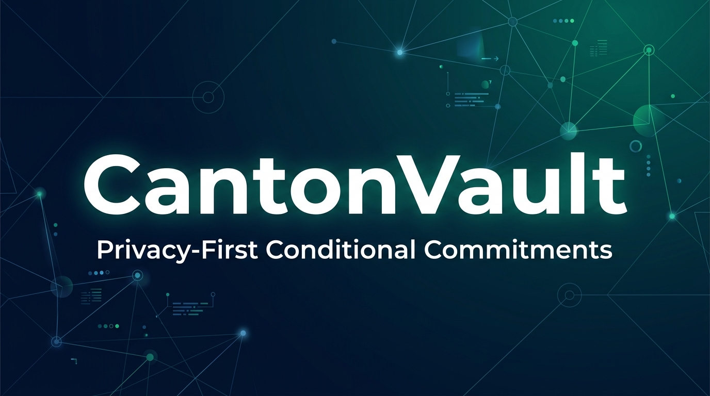

# CantonVault — Privacy-First Conditional Commitments on Canton Network

[](https://www.encodeclub.com/programmes/canton-hackathon)
[]()
[](https://docs.digitalasset.com/daml)
[](./LICENSE)
[]()



> Selective disclosure protocol where privacy is an **emergent property of stakeholder scoping** — competitors see empty ledgers by design, not by encryption.

---

## Problem

In institutional finance, parties need to share the **minimum necessary** to execute — without exposing portfolio positions, revealing factoring relationships, or leaking pricing to competitors. Today's infrastructure forces a binary choice: full transparency (everyone sees everything) or trust-based opacity (unverifiable).

> **Result**: double-factoring in invoice finance (billions in losses), OTC block trade leakage (adverse market moves), and heavy Basel III / MiCA compliance overhead.

## Solution

**CantonVault** is a Daml primitive that acts as a **privacy-first conditional commitment**:

- **Buyer + Supplier** see the commitment and terms
- **Third party** (arbitrator, clearing house) sees **nothing** until on-demand selective disclosure
- **Competitor** on the same network sees an **empty ledger** — privacy guaranteed at the Canton protocol level

Settlement executes **atomically in Canton Coin** via Splice Allocation/Transfer standard when the commitment is fulfilled (real DvP).

---

## How It Works

### 1. Propose → Accept

```
Proposer creates CommitmentProposal → Accepter signs → CommitmentContract active
                                         (both are signatories, third party is NOT)
```

### 2. Fulfill with Canton Coin Settlement

```
Accepter confirms delivery → Fulfill choice executed
  ├── Symbolic: creates SettlementReceipt (immutable proof)
  └── Real: exercises Allocation_ExecuteTransfer via Splice token standard (atomic CC transfer)
```

### 3. Selective Disclosure (on-demand)

```
RaiseDispute → DisputeCase created (third party becomes observer)
             → DisclosedRecord created (immutable disclosure proof)
             → Third party now sees: amount + description (nothing else)

ResolveDispute → DisputeCase archived + resolution DisclosedRecord created
```

### 4. Refund

```
After deadline → Proposer can refund if commitment not fulfilled
```

---

## Architecture

```
┌──────────────────────────────────────────────────────────┐
│                    CantonVault Architecture                │
├──────────────────────────────────────────────────────────┤
│  ┌─────────────┐    ┌─────────────┐    ┌─────────────┐  │
│  │ Frontend     │    │ Backend     │    │ Daml Layer   │  │
│  │ (Vite+React) │───▶│ (SpringBoot)│───▶│ (5 templates)│  │
│  │ VaultView.tsx │    │ /vault/*    │    │ gRPC Ledger  │  │
│  └─────────────┘    └──────┬──────┘    └──────┬──────┘  │
│                            │                   │          │
│                   ┌────────▼────────┐  ┌──────▼──────┐  │
│                   │ Token Registry  │  │ PQS          │  │
│                   │ (Splice Splice) │  │ (PostgreSQL) │  │
│                   └────────┬────────┘  └─────────────┘  │
│                            │                              │
│                   ┌────────▼─────────────────────────┐   │
│                   │ Canton Network (Validator Node)   │   │
│                   │ ┌───────┐ ┌───────┐ ┌──────────┐ │   │
│                   │ │Party A│ │Party B│ │Arbitrator│ │   │
│                   │ │(full) │ │(full) │ │(none*)   │ │   │
│                   │ └───────┘ └───────┘ └──────────┘ │   │
│                   │ *until dispute/disclosure          │   │
│                   └───────────────────────────────────┘   │
└──────────────────────────────────────────────────────────┘
```

### Contract Templates (Daml)

| Template | Purpose | Privacy |
|---|---|---|
| `CommitmentProposal` | Offer to enter a commitment | Proposer: signatory, Accepter: observer |
| `CommitmentContract` | Active conditional commitment | Proposer+Accepter: signatories, ThirdParty: NOT in signatory/observer |
| `DisputeCase` | Escalation to third party | Third party enters as observer |
| `DisclosedRecord` | Immutable disclosure proof | Discloser+Observer: signatories |
| `SettlementReceipt` | Settlement audit trail | Proposer+Accepter: signatories |

---

## Demo

| Artifact | Link |
|---|---|
| Live Frontend | [https://canton-vault.pages.dev](https://canton-vault.pages.dev) |
| Pitch Video (3 min) | [Uploading]() |
| Technical Demo | [Uploading]() |
| GitHub Repo | [https://github.com/ruwaq/CantonVault](https://github.com/ruwaq/CantonVault) |

---

## Canton Network DevNet Deployment ✅

CantonVault smart contracts are **deployed and running on-ledger** on the Canton Network DevNet (not just LocalNet/sandbox).

### How to deploy (reproducible)

```bash
# 1. Compile the DAR
cd cn-quickstart/quickstart/daml/licensing
~/.daml/bin/daml build   # produces cantonvault-contracts-0.1.0.dar

# 2. Deploy to DevNet
./scripts/devnet-deploy.sh           # uploads DAR + verifies access
./scripts/devnet-create-contract.sh  # creates a CommitmentProposal on-ledger
```

### DevNet connection details

- **Ledger API**: `https://ledger-api.validator.devnet.sandbox.fivenorth.io/`
- **Auth**: OAuth2 client-credentials (`validator-devnet-m2m`)
- **Network**: Canton Network DevNet (splice v0.6.12, Canton 3.5.7)
- **Party**: `5nsandbox-devnet-2::1220a14ca128063b8dc9d1ebb0bd22633be9f2168500f4dbc1ecaeb1855b14e5acf8`

### Evidence of on-ledger deployment (2026-07-13)

| # | Workflow | Amount | updateId (tx hash) | Offset |
|---|---|---|---|---|
| 1 | supply-chain-finance | 5,000 CC | `1220c521048ebd4392a67d331a0cb6cebbc1beb03aed7da2b34ba1e40b4cedfec9f9` | 4297574 |
| 2 | supply-chain-finance | 7,500 CC | `12207d01a2205c3b578ff9fecf0fdefbb14cd9ba8f75f61eb6f5c652e0209e483113` | 4297626 |
| 3 | supply-chain-finance | 12,000 CC | `1220e723952e21684661ac7f0a6fcf0db66e570866d062bf34ba938d23ab2090ce01` | 4297881 |
| 4 | invoice-financing | 3,000 CC | `12202b830f37bcab5a0a234565bc6acd328e8eea979d6b71967068d2430cffb89678` | 4298442 |
| 5 | otc-block-trade | 25,000 CC | `12204b7cf00a72988934e883439f48da8df2d0497435f2d9e6df87b7826aebb7d27c` | 4298435 |

**Total: 5 CommitmentProposal contracts on-ledger, 52,500 CC across all 3 workflow scenarios.**

Verify on-ledger yourself:
```bash
cd cli && npm install && npm run build
node dist/index.js status          # → Canton 3.5.7, offset ~4.3M
node dist/index.js propose --amount 1000   # → creates a NEW contract on-ledger
```

### CantonVault CLI (`cli/`)

A typed TypeScript CLI for interacting with CantonVault contracts on the DevNet:

```bash
cd cli && npm install && npm run build

node dist/index.js status                              # DevNet connectivity
node dist/index.js deploy                              # upload DAR
node dist/index.js propose --amount 5000               # create CommitmentProposal
node dist/index.js packages                            # list vetted packages
```

> **Note**: The shared hackathon validator (`validator-devnet-m2m`) exposes a limited REST API surface (submit, packages, parties, users). The full propose→accept→fulfill→dispute lifecycle is demonstrated end-to-end in LocalNet (22 passing Daml tests + live backend), while DevNet proves the contracts run on-ledger on the real Canton Network synchronizer.

---

## Quick Start

```bash
# 1. Clone and build
git clone https://gitlab.com/PrometeoDev/cantonvault.git
cd cantonvault/cn-quickstart/quickstart

# 2. Build Daml contracts
~/.daml/bin/daml build --package-root daml/licensing

# 3. Run backend + frontend via Docker Compose
docker compose up -d
```

### Run Tests

```bash
~/.daml/bin/daml test --package-root daml/licensing-tests    # 12 tests (incl. privacy)
./gradlew :backend:compileJava                                # Backend compile
cd frontend && npx tsc --noEmit                               # Frontend typecheck
```

---

## Tech Stack

| Layer | Technology | Canton Integration |
|---|---|---|
| Smart Contracts | **Daml 3.x** | Native Canton ledger via gRPC |
| Settlement | **Splice Token Standard** | Allocation/AllocationRequest interfaces |
| Token Registry | **Splice Registry API** | Allocation transfer context (disclosed contracts) |
| Backend | **Spring Boot 3.4** | Canton gRPC Ledger API v2 + PQS (PostgreSQL) |
| Frontend | **React 18 + Vite + TypeScript** | REST API via `/api/vault/*` |
| Infrastructure | **Docker Compose** | Splice onboarding, Canton validator, nginx |
| Wallet | **Splice Wallet UI (LocalNet)** | Canton Coin minting & party allocation |
| IDE | **Seaport LocalNet** | DAR deployment, contract interaction |

> **Note on wallets**: The Canton Wallet UI (for minting Canton Coin) is distinct from the Loop Wallet used for party allocation — see the [Splice Wallet Reference](https://docs.canton.network/overview/reference/splice-wallet-reference#wallet-ui).

---

## Team

**Ande (andelabs)** — Solo builder  
- Full-stack blockchain developer with Daml/Rust/Solidity expertise  
- Focused on institutional DeFi primitives and privacy-preserving protocols

---

## Architecture

```
┌──────────────────────────────────────────────────────┐
│ FRONTEND (React 18 + TypeScript + Vite)              │
│ VaultView: propose → accept → fulfill → dispute      │
│ Wallet deep-link: Splice wallet-web-ui for signing   │
├──────────────────────────────────────────────────────┤
│ BACKEND (Spring Boot 3.4 + Java 21)                  │
│ REST API (/vault/*) → LedgerApi (gRPC multi-party)   │
│ PQS (Postgres read replica) → DamlRepository          │
│ Auth: OAuth2 Keycloak (JWT claims: party_id, roles)  │
│ Tenant store: Postgres (survives restarts)           │
├──────────────────────────────────────────────────────┤
│ DAML CONTRACTS (SDK 3.4.11)                          │
│ CommitmentProposal → Accept → CommitmentContract      │
│ Fulfill (real DvP CC) / Refund / RaiseDispute         │
│ AllocationRequest interface (Splice token standard)   │
│ SettlementReceipt + DisclosedRecord (evidence)        │
├──────────────────────────────────────────────────────┤
│ CANTON NETWORK (LocalNet / mainnet)                    │
│ Participant node (gRPC) + PQS (Postgres projection)  │
│ Splice Registry (token standard factory + context)    │
│ Wallet-web-ui (user-controlled signing)              │
└──────────────────────────────────────────────────────┘
```

## DvP Pattern (reusable for Canton ecosystem)

CantonVault implements the **Delivery-vs-Payment** pattern using the Splice
`AllocationRequest` interface — the same pattern used by the official
`TestAmuletTokenDvP` and `LicenseRenewalRequest` in the Canton quickstart.

### Key design decisions for mainnet settlement

| Decision | Why |
|----------|-----|
| `instrumentAdmin = DSO` | The Canton Coin (Amulet) admin must be the DSO party, not the proposer. Without this, the allocation factory rejects settlement. |
| `executor = accepter` | The `Allocation_ExecuteTransfer` must be exercised by the settlement executor. Since `Fulfill` is `controller accepter`, the executor must be the accepter. |
| `requestedAt = createdAt` | The allocation factory requires `requestedAt <= now`. Using `deadline` (a future timestamp) blocks all settlement. Set to contract creation time. |
| Field-level validation vs `===` | The allocation factory adjusts metadata/timestamps. Validate individual fields (amount, sender, receiver, instrumentAdmin) rather than strict record equality. |

### How to reuse this pattern

1. Make your template implement `AllocationRequest` (from `splice-api-token-allocation-request-v1`)
2. Set `settlement.executor` = the party who exercises your settlement choice
3. Set `transferLeg.sender/receiver/amount/instrumentId` correctly
4. Use `RegistryApi.getAllocationFactory` to create the allocation
5. Use `RegistryApi.getAllocation_TransferContext` to build `ExtraArgs`
6. Exercise `Allocation_ExecuteTransfer` with the allocation contract ID + ExtraArgs

Full reference implementation: `daml/licensing-tests/daml/Vault/Scripts/TestRealSettlement.daml`

## Security

See [SECURITY.md](./SECURITY.md) for the full audit report (2026-07-03), vulnerability disclosures, and hardening guidelines.

### Quick setup

```bash
# 1. Set the demo token (required — auth is disabled without it)
export DEMO_TOKEN=demo

# 2. Start the local network
./cn-quickstart/quickstart/run-localnet.sh

# 3. Open http://app-provider.localhost:5173
```

> **⚠️ The `shared-secret` auth profile is intended for local development and hackathon demos only.** Never deploy to an accessible network without setting a strong `DEMO_TOKEN` and using the OAuth2 profile for production.

---

## Roadmap

- **Hackathon**: Complete flow with real Canton Coin settlement on LocalNet
- **Post-hackathon**: Contract keys for uniqueness guarantees, multi-party disclosure UI
- **Featured App**: Apply for Canton Foundation Protocol Development Fund grant for Cantonomics rewards (62% of ~516M CC/month)

---

## License

MIT — see [LICENSE](./LICENSE)