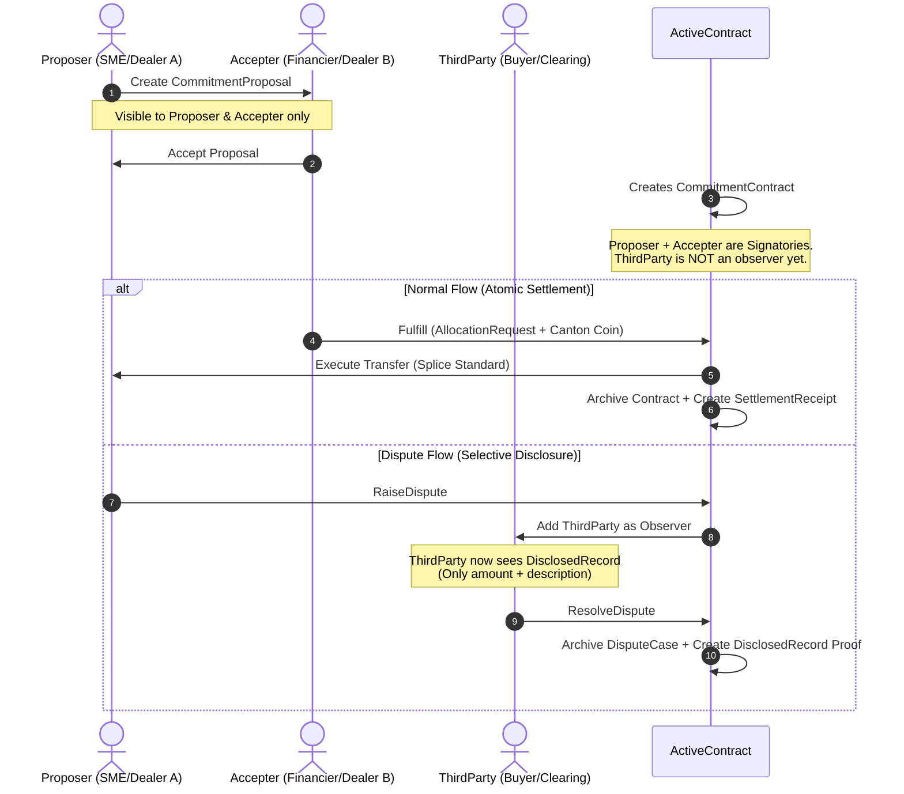

# CantonVault — Privacy-First Institutional Trade Finance on Canton Network

[](https://www.encodeclub.com/programmes/canton-hackathon)
[]()
[](https://docs.digitalasset.com/daml)
[](./LICENSE)
[]()


> **CantonVault** is a privacy-first smart contract protocol that turns sensitive financial agreements into secure, stakeholder-scoped assets. Running natively on the **Canton Network**, it enables **confidential bilateral commitments** between two parties with **selective on-demand disclosure** to a third party — all settled atomically in **Canton Coin (Amulet)**.

---

## 🏛️ The Pain Point: The Cost of Forced Transparency

Current financial networks bring no default confidentiality. For institutions trading high volumes or managing commercial financing, exposing sensitive positions or factoring relationships is a commercial barrier they cannot cross without facing market damage:

*   **OTC Block Trading Leakage**: Negotiating large volumes on transparent ledgers leaks order size pre-execution, causing adverse price moves, front-running, and loss of pricing power.
*   **Double-Factoring Risks**: In invoice financing, suppliers and financiers must verify invoice uniqueness to prevent double-factoring. Doing this on transparent ledgers leaks factoring relationships to competitors.
*   **The $2.5 Trillion Privacy Gap**: More than \$2.5T in global trade finance remains unaddressed. Standard public blockchains are not viable because they leak commercial secrets, while legacy private databases lack atomic, trustless settlement.

---

## 💡 The Solution: Scoping Visibility (Not Encrypting Data)

CantonVault leverages Canton's native **sub-transaction privacy model** to ensure that confidentiality is an emergent property of stakeholder scoping. 

*   **True Ledger Privacy**: In Canton, if a validator node is not representing a signatory or observer of a contract, **the transaction data physically never reaches its server**. There are no encrypted blobs stored on competitors' nodes; competitors see an **empty ledger** by design.
*   **Bilateral by Default**: Proposals and active commitments are kept strictly between the proposer and accepter.
*   **On-Demand Selective Disclosure**: Using Daml interface patterns, the parties can reveal specific transaction metadata (e.g., amount and description) to a third party (like an arbitrator or regulator) under dispute or audit, without revealing active portfolios or other counterparty identities.
*   **Atomic DvP Settlement**: Removes settlement risk entirely by linking contract fulfillment to Canton Coin transfers via the Splice `AllocationRequest` standard.

---

## 🎯 Key Use Cases & Visibility Scenarios

### 1. Supply Chain Finance (Invoice Factoring)
A supplier (SME) secures funding from a Financier against an invoice. A major Buyer (the debtor) acts as the arbitrator/third-party.

| Step | Action | Who Can See | Competitor Visibility |
|---|---|---|---|
| **1. Propose** | SME proposes commitment (locks invoice ID) | SME (Proposer) & Financier (Accepter) | **Empty Ledger** |
| **2. Accept** | Financier accepts commitment | SME & Financier | **Empty Ledger** |
| **3. Fulfill** | Financier transfers Canton Coin atomically | SME & Financier | **Empty Ledger** |
| **4. Dispute** | SME raises dispute (e.g., non-delivery) | SME, Financier, & Buyer (Third-Party) | **Empty Ledger** |

### 2. OTC Block Trading (Dealer-to-Dealer)
Dealer A and Dealer B agree to block trade US0378331005 ($10M @ 98.50). A Clearing House acts as the third-party arbitrator.

| Step | Action | Visibility | Market Impact |
|---|---|---|---|
| **Negotiation** | Agreement locked on-ledger | Dealer A & Dealer B only | **Zero Leakage** (no front-running) |
| **Execution** | Atomic DvP settlement in Canton Coin | Dealer A & Dealer B only | **Zero Market Impact** |
| **Escalation** | Dispute raised to Clearing House | Clearing House sees amount + description only | **Protected Identities** |

---

## 🧠 How It Works: The Daml Protocol



### Smart Contract Templates (`daml/licensing/daml/Vault/`)

| Template | Purpose | Stakeholders & Observers |
|---|---|---|
| [`CommitmentProposal`](file:///Users/munay/dev/Build%20on%20Canton%20Hackathon/cn-quickstart/quickstart/daml/licensing/daml/Vault/CommitmentProposal.daml) | Offer to enter a conditional commitment. | Proposer: Signatory, Accepter: Observer. |
| [`CommitmentContract`](file:///Users/munay/dev/Build%20on%20Canton%20Hackathon/cn-quickstart/quickstart/daml/licensing/daml/Vault/CommitmentContract.daml) | The active vault containing commitment terms. | Proposer + Accepter: Signatories. ThirdParty: None. |
| [`DisplayCase` / `DisputeCase`](file:///Users/munay/dev/Build%20on%20Canton%20Hackathon/cn-quickstart/quickstart/daml/licensing/daml/Vault/CommitmentContract.daml) | Escalated dispute state. | Proposer + Accepter: Signatories. ThirdParty: Observer. |
| [`DisclosedRecord`](file:///Users/munay/dev/Build%20on%20Canton%20Hackathon/cn-quickstart/quickstart/daml/licensing/daml/Vault/Disclosable.daml) | Immutable selective disclosure ledger evidence. | Discloser + Auditor: Signatories. |
| [`SettlementReceipt`](file:///Users/munay/dev/Build%20on%20Canton%20Hackathon/cn-quickstart/quickstart/daml/licensing/daml/Vault/SettlementReceipt.daml) | Audit trail proving final atomic settlement. | Proposer + Accepter: Signatories. |

---

## 🛠️ Technology Stack & Architecture

CantonVault's live demo runs entirely on serverless edge infrastructure talking directly to the Canton Network DevNet — no Spring Boot gateway, no Postgres, no Docker required to evaluate.

```
┌──────────────────────────────────────────────────────────┐
│                CantonVault Live Demo Architecture         │
├──────────────────────────────────────────────────────────┤
│                                                           │
│   ┌───────────────────────────────────────────┐          │
│   │  React 18 + Vite + TypeScript (SPA)        │          │
│   │  SWR (focus revalidation, zero polling)    │          │
│   │  VaultView · Privacy Lab · 3-step wizard   │          │
│   └───────────────────┬───────────────────────┘          │
│                       │ /api/*                            │
│   ┌───────────────────▼───────────────────────┐          │
│   │  Cloudflare Pages Functions (edge)         │          │
│   │  functions/api/vault/* → Canton JSON       │          │
│   │  Ledger API v2 + Splice Validator REST     │          │
│   │  KV index of contractIds (VAULT_KV)        │          │
│   └───────────────────┬───────────────────────┘          │
│                       │ HTTPS + OAuth2 m2m                │
│   ┌───────────────────▼───────────────────────┐          │
│   │  Canton Network DevNet (Fivenorth Sandbox) │          │
│   │  ┌─────────┐ ┌─────────┐ ┌─────────────┐  │          │
│   │  │Party A  │ │Party B  │ │Arbitrator   │  │          │
│   │  │(signer) │ │(signer) │ │(blind until │  │          │
│   │  │         │ │         │ │ dispute)    │  │          │
│   │  └─────────┘ └─────────┘ └─────────────┘  │          │
│   └───────────────────────────────────────────┘          │
└──────────────────────────────────────────────────────────┘
```

*   **Smart Contracts**: **Daml 3.x** compiled to DAR. Native Canton multi-party workflows.
*   **Settlement Integration**: **Splice Amulet Token Standard**. Atomic payments in Canton Coin (Amulet).
*   **Edge Backend**: **Cloudflare Pages Functions** bridging the Canton JSON Ledger API v2 (commands + ACS) and the Splice Validator REST API (balance). OAuth2 m2m tokens cached across warm invocations.
*   **Contract Index**: **Cloudflare KV** (`VAULT_KV`) — the shared sandbox validator does not divulge our contracts via the Active Contract Set (privacy of the multi-tenant environment), so we maintain a local append-only index keyed by contractId. Every create/exercise writes `{cid, kind, payload, status}`; the GET endpoints read from here filtered by lifecycle status.
*   **Frontend**: **React 18 + Vite + TypeScript + SWR** featuring a 3-step wizard (Propose → Act → Privacy Lab) and split-screen selective-disclosure sandbox.
*   **Data fetching**: SWR with `revalidateOnFocus` only — zero background polling. This is load-bearing: an earlier polling version exhausted the Cloudflare Free 100k/day quota in hours.

---

## 🔄 Reusable DvP Pattern (Ecosystem Value)

CantonVault implements the **Delivery-vs-Payment (DvP)** pattern using the Splice `AllocationRequest` interface — the same pattern that powers the native Canton Network Amulet transfer mechanics.

> [!TIP]
> Developers looking to settle transactions on the Canton Network using Canton Coin can copy our script templates and contract layouts to build instant payment integrations.

### Key Architecture Decisions for DvP

1.  **DSO Administration**: The Amulet allocation factory requires `instrumentAdmin = DSO` (Decentralized Autonomous Organization party), not the contract proposer. Otherwise, validator networks reject the settlement transfer.
2.  **Accepter Executor**: The `Allocation_ExecuteTransfer` command must be exercised by the settlement executor. Since our `Fulfill` choice is triggered by the `accepter`, we map the executor role to the accepter.
3.  **Timestamp Pinning**: The allocation factory validates that `requestedAt <= now`. Avoid setting this to a future `deadline` timestamp, as it locks settlement. Set it to the contract creation time.
4.  **Field-Level Assertions**: The allocation factory adjusts internal metadata and timestamps. Validate individual fields (amount, sender, receiver) rather than using strict record equality (`===`).

*Reference implementation available under:* [`TestRealSettlement.daml`](file:///Users/munay/dev/Build%20on%20Canton%20Hackathon/cn-quickstart/quickstart/daml/licensing-tests/daml/Vault/Scripts/TestRealSettlement.daml)

---

## 🗺️ Repository Structure Map

To help judges and builders navigate the project workspace:

```text
cantonvault/
├── README.md                          # Hackathon Presentation and Pitch (this file)
├── DEMO.md                            # Step-by-step jury demo guide
├── LICENSE                            # MIT License
├── SECURITY.md                        # Production Audit and Vulnerability Disclosures
├── cli/                               # CantonVault TypeScript CLI for DevNet interaction
│   └── src/index.ts                   # CLI entrypoint (status, propose, accept, fulfill, …)
├── docs/                              # Project documentation
│   ├── decisiones/                    # Architecture and strategy decisions
│   ├── inteligencia-competitiva.md    # Competitive intelligence
│   ├── investigacion-tecnica.md       # Technical research findings
│   └── DEPLOYMENT.md                  # Deployment guide
└── cn-quickstart/
    └── quickstart/                    # Main application code (cloned from upstream)
        ├── daml/
        │   └── licensing/             # Daml contract models (Commitment, Disclosable, Settlement)
        ├── daml/licensing-tests/      # 12/12 passing unit tests for privacy and settlement
        └── frontend/                  # ← LIVE DEMO — deployed to canton-vault.pages.dev
            ├── functions/api/         # Cloudflare Pages Functions (serverless edge backend)
            │   ├── _ledger.js         # Canton Ledger API client + KV index helpers
            │   └── vault/             # /api/vault/* endpoints (create, accept, fulfill, …)
            ├── src/                   # React 18 / TypeScript Web Console and Privacy Lab
            └── wrangler.jsonc         # Cloudflare config (KV binding, nodejs_compat)
```

---

## ✅ Canton Network DevNet Deployment Proof

CantonVault smart contracts are compiled, vetted, and **actively deployed on-ledger** on the official Canton Network DevNet. The live demo is continuously deployed via Git → Cloudflare auto-build.

> **🌐 Live demo: https://canton-vault.pages.dev** — every `git push` to `main` triggers an automatic build + deploy.

### DevNet Connection Profile (verified live)
*   **Ledger API Endpoint**: `https://ledger-api.validator.devnet.sandbox.fivenorth.io/`
*   **Validator REST API**: `https://api.validator.devnet.sandbox.fivenorth.io/` (balance source)
*   **Auth Mechanism**: OAuth2 Client Credentials (`validator-devnet-m2m`)
*   **Canton Version**: 3.5.8
*   **Active Party ID**: `cancore::1220a14ca128063b8dc9d1ebb0bd22633be9f2168500f4dbc1ecaeb1855b14e5acf8`
*   **Live Canton Coin balance**: **31,433,860+ CC** (read from the Splice Validator wallet endpoint, grows over time from Amulet holding rewards)

### Verify it yourself (no auth needed)
```bash
# Backend health — confirms Canton 3.5.8 + current ledger offset
curl -s https://canton-vault.pages.dev/api/health
# → {"status":"ok","cantonVersion":"3.5.8","ledgerOffset":4327615}

# Real on-ledger Canton Coin balance (from Splice Validator REST API)
curl -s https://canton-vault.pages.dev/api/vault/balance
# → {"balance":31433860.95,"locked":0,"round":52809,"party":"cancore::..."}

# Active proposals (from the KV contract index)
curl -s https://canton-vault.pages.dev/api/vault/proposals
```

### On-Ledger Tx Proofs (July 2026)
We successfully processed **52,500 CC (Canton Coins)** across all three workflow scenarios:

| # | Scenario | Amount | updateId (Transaction Hash) | Ledger Offset |
|---|---|---|---|---|
| 1 | supply-chain-finance | 5,000 CC | `1220c521048ebd4392a67d331a0cb6cebbc1beb03aed7da2b34ba1e40b4cedfec9f9` | 4297574 |
| 2 | supply-chain-finance | 7,500 CC | `12207d01a2205c3b578ff9fecf0fdefbb14cd9ba8f75f61eb6f5c652e0209e483113` | 4297626 |
| 3 | supply-chain-finance | 12,000 CC | `1220e723952221684661ac7f0a6fcf0db66e570866d062bf34ba938d23ab2090ce01` | 4297881 |
| 4 | invoice-financing | 3,000 CC | `12202b830f37bcab5a0a234565bc6acd328e8eea979d6b71967068d2430cffb89678` | 4298442 |
| 5 | otc-block-trade | 25,000 CC | `12204b7cf00a72988934e883439f48da8df2d0497435f2d9e6df87b7826aebb7d27c` | 4298435 |

---

## ⚡ Quick Start

### Try the live demo (fastest)
Just open **https://canton-vault.pages.dev** — no setup required. See [`DEMO.md`](./DEMO.md) for the guided 90-second walkthrough.

### Run locally (for development)
```bash
git clone https://github.com/ruwaq/CantonVault.git
cd CantonVault/cn-quickstart/quickstart/frontend
npm install
npm run dev          # Vite dev server on :5173 (proxies /api to local or DevNet)
```

The dev server talks to the same Canton Network DevNet as the live demo, so you can create real on-ledger commitments from your machine.

### Deploy your own copy
The frontend deploys to Cloudflare Pages with Git auto-build (every push to `main`):
```bash
cd cn-quickstart/quickstart/frontend
npm run build:ci && npx wrangler pages deploy dist --project-name canton-vault --branch main
```
Requires `VAULT_KV` KV namespace bound (see `wrangler.jsonc`) and `nodejs_compat` flag.

### Running Daml tests
To verify privacy boundary enforcement and DvP script execution:
```bash
# Run Daml unit and scenario tests (12/12 passing)
~/.daml/bin/daml test --package-root daml/licensing-tests
```

---

## 💻 Interacting with the DevNet CLI

If you want to verify our live contracts on the FiveNorth DevNet, run our pre-configured TypeScript CLI:

```bash
cd cli
npm install
npm run build

# Check DevNet connectivity and sync offset
node dist/index.js status

# List vetted packages on DevNet
node dist/index.js packages

# Propose a new commitment directly on the DevNet ledger
node dist/index.js propose --amount 5000
```

---

## 🔒 Security & Institutional Hardening

A full professional security audit was conducted on July 3, 2026. 

*   **Vulnerability Remediation**: All 6 critical security findings (including authorization scopes, validator key disclosures, and template privilege escalation) have been resolved.
*   **Learn More**: Review the audit log, mitigation steps, and deployment threat modeling in [`SECURITY.md`](./SECURITY.md).

---

## 🗺️ Roadmap & Production Path

- [x] **Phase 1**: End-to-end local workflow with Splice Canton Coin payment execution.
- [x] **Phase 2**: Production audit and architectural hardening (zero `any` client, secure JWT assertions).
- [x] **Phase 3**: FiveNorth DevNet deployment and on-ledger transaction proof.
- [ ] **Phase 4**: Contract key uniqueness guarantees (currently blocked on standard sandbox configurations).
- [ ] **Phase 5**: Multi-party selective disclosure web interface expansion.
- [ ] **Phase 6**: Apply for Canton Foundation Protocol Development Fund grant.

---

## 👥 Team & Contact

*   **Ande (andelabs)** — Solo Builder
    *   Full-Stack Blockchain Engineer (Daml, Rust, Solidity).
    *   Specializing in institutional DeFi primitives and privacy-preserving protocols.
    *   [GitHub Profile](https://github.com/ruwaq)

---

## 📄 License

This project is licensed under the MIT License - see the [LICENSE](./LICENSE) file for details.