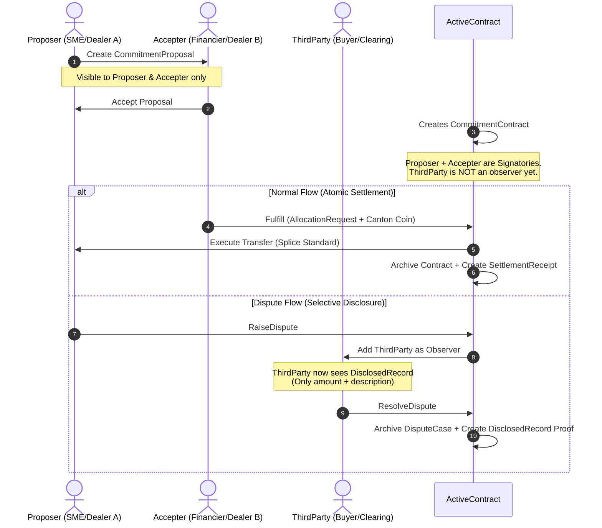

# CantonVault — Privacy-First Institutional Trade Finance on Canton Network

[](https://www.encodeclub.com/programmes/canton-hackathon)
[]()
[](https://docs.digitalasset.com/daml)
[](./LICENSE)
[]()


> **CantonVault** is a privacy-first smart contract protocol that turns sensitive financial agreements into secure, stakeholder-scoped assets. Running natively on the **Canton Network**, it enables **confidential bilateral commitments** between two parties with **selective on-demand disclosure** to a third party — all settled atomically in **Canton Coin (Amulet)**.

---

## 🏛️ The Pain Point: The Cost of Forced Transparency

Current financial networks bring no default confidentiality. For institutions trading high volumes or managing commercial financing, exposing sensitive positions or factoring relationships is a commercial barrier they cannot cross without facing market damage:

*   **OTC Block Trading Leakage**: Negotiating large volumes on transparent ledgers leaks order size pre-execution, causing adverse price moves, front-running, and loss of pricing power.
*   **Double-Factoring Risks**: In invoice financing, suppliers and financiers must verify invoice uniqueness to prevent double-factoring. Doing this on transparent ledgers leaks factoring relationships to competitors.
*   **The $2.5 Trillion Privacy Gap**: More than \$2.5T in global trade finance remains unaddressed. Standard public blockchains are not viable because they leak commercial secrets, while legacy private databases lack atomic, trustless settlement.

---

## 💡 The Solution: Scoping Visibility (Not Encrypting Data)

CantonVault leverages Canton's native **sub-transaction privacy model** to ensure that confidentiality is an emergent property of stakeholder scoping. 

*   **True Ledger Privacy**: In Canton, if a validator node is not representing a signatory or observer of a contract, **the transaction data physically never reaches its server**. There are no encrypted blobs stored on competitors' nodes; competitors see an **empty ledger** by design.
*   **Bilateral by Default**: Proposals and active commitments are kept strictly between the proposer and accepter.
*   **On-Demand Selective Disclosure**: Using Daml interface patterns, the parties can reveal specific transaction metadata (e.g., amount and description) to a third party (like an arbitrator or regulator) under dispute or audit, without revealing active portfolios or other counterparty identities.
*   **Atomic DvP Settlement**: Removes settlement risk entirely by linking contract fulfillment to Canton Coin transfers via the Splice `AllocationRequest` standard.

---

## 🎯 Key Use Cases & Visibility Scenarios

### 1. Supply Chain Finance (Invoice Factoring)
A supplier (SME) secures funding from a Financier against an invoice. A major Buyer (the debtor) acts as the arbitrator/third-party.

| Step | Action | Who Can See | Competitor Visibility |
|---|---|---|---|
| **1. Propose** | SME proposes commitment (locks invoice ID) | SME (Proposer) & Financier (Accepter) | **Empty Ledger** |
| **2. Accept** | Financier accepts commitment | SME & Financier | **Empty Ledger** |
| **3. Fulfill** | Financier transfers Canton Coin atomically | SME & Financier | **Empty Ledger** |
| **4. Dispute** | SME raises dispute (e.g., non-delivery) | SME, Financier, & Buyer (Third-Party) | **Empty Ledger** |

### 2. OTC Block Trading (Dealer-to-Dealer)
Dealer A and Dealer B agree to block trade US0378331005 ($10M @ 98.50). A Clearing House acts as the third-party arbitrator.

| Step | Action | Visibility | Market Impact |
|---|---|---|---|
| **Negotiation** | Agreement locked on-ledger | Dealer A & Dealer B only | **Zero Leakage** (no front-running) |
| **Execution** | Atomic DvP settlement in Canton Coin | Dealer A & Dealer B only | **Zero Market Impact** |
| **Escalation** | Dispute raised to Clearing House | Clearing House sees amount + description only | **Protected Identities** |

---

## 🧠 How It Works: The Daml Protocol



### Smart Contract Templates (`daml/licensing/daml/Vault/`)

| Template | Purpose | Stakeholders & Observers |
|---|---|---|
| [`CommitmentProposal`](file:///Users/munay/dev/Build%20on%20Canton%20Hackathon/cn-quickstart/quickstart/daml/licensing/daml/Vault/CommitmentProposal.daml) | Offer to enter a conditional commitment. | Proposer: Signatory, Accepter: Observer. |
| [`CommitmentContract`](file:///Users/munay/dev/Build%20on%20Canton%20Hackathon/cn-quickstart/quickstart/daml/licensing/daml/Vault/CommitmentContract.daml) | The active vault containing commitment terms. | Proposer + Accepter: Signatories. ThirdParty: None. |
| [`DisplayCase` / `DisputeCase`](file:///Users/munay/dev/Build%20on%20Canton%20Hackathon/cn-quickstart/quickstart/daml/licensing/daml/Vault/CommitmentContract.daml) | Escalated dispute state. | Proposer + Accepter: Signatories. ThirdParty: Observer. |
| [`DisclosedRecord`](file:///Users/munay/dev/Build%20on%20Canton%20Hackathon/cn-quickstart/quickstart/daml/licensing/daml/Vault/Disclosable.daml) | Immutable selective disclosure ledger evidence. | Discloser + Auditor: Signatories. |
| [`SettlementReceipt`](file:///Users/munay/dev/Build%20on%20Canton%20Hackathon/cn-quickstart/quickstart/daml/licensing/daml/Vault/SettlementReceipt.daml) | Audit trail proving final atomic settlement. | Proposer + Accepter: Signatories. |

---

## 🛠️ Technology Stack & Architecture

CantonVault is architected to support institutional volumes, dividing heavy multi-party state machine processing from low-latency query operations.

```
┌──────────────────────────────────────────────────────────┐
│                   CantonVault Architecture               │
├──────────────────────────────────────────────────────────┤
│  ┌─────────────┐    ┌─────────────┐    ┌─────────────┐   │
│  │ Frontend     │    │ Backend     │    │ Daml Layer   │   │
│  │ (Vite+React) │───▶│ (SpringBoot)│───▶│ (5 templates)│   │
│  │ VaultView.tsx │    │ /vault/*    │    │ gRPC Ledger  │   │
│  └─────────────┘    └──────┬──────┘    └──────┬──────┘   │
│                            │                   │         │
│                   ┌────────▼────────┐  ┌──────▼──────┐   │
│                   │ Token Registry  │  │ PQS          │   │
│                   │ (Splice Amulet) │  │ (PostgreSQL) │   │
│                   └────────┬────────┘  └─────────────┘   │
│                            │                             │
│                   ┌────────▼─────────────────────────┐   │
│                   │ Canton Network (Validator Node)   │   │
│                   │ ┌───────┐ ┌───────┐ ┌──────────┐ │   │
│                   │ │Party A│ │Party B│ │Arbitrator│ │   │
│                   │ │(full) │ │(full) │ │(none*)   │ │   │
│                   │ └───────┘ └───────┘ └──────────┘ │   │
│                   │ *until dispute/disclosure        │   │
│                   └───────────────────────────────────┘   │
└──────────────────────────────────────────────────────────┘
```

*   **Smart Contracts**: **Daml 3.x** compiled to DAR. Native Canton multi-party workflows.
*   **Settlement Integration**: **Splice Amulet Token Standard**. Atomic payments in Canton Coin.
*   **Backend Services**: **Spring Boot 3.4 + Java 21** communicating over gRPC Ledger API v2.
*   **Read Replica Integration**: **Postgres Query Service (PQS)** querying the local participant node projection table, bypasses slow ledger lookups for fast React dashboard updates.
*   **Frontend**: **React 18 + Vite + TypeScript** featuring a split-screen "Privacy Lab" sandbox.
*   **Local Infrastructure**: **Docker Compose** orchestrating splice services, Postgres DBs, and local Canton participants.

---

## 🔄 Reusable DvP Pattern (Ecosystem Value)

CantonVault implements the **Delivery-vs-Payment (DvP)** pattern using the Splice `AllocationRequest` interface — the same pattern that powers the native Canton Network Amulet transfer mechanics.

> [!TIP]
> Developers looking to settle transactions on the Canton Network using Canton Coin can copy our script templates and contract layouts to build instant payment integrations.

### Key Architecture Decisions for DvP

1.  **DSO Administration**: The Amulet allocation factory requires `instrumentAdmin = DSO` (Decentralized Autonomous Organization party), not the contract proposer. Otherwise, validator networks reject the settlement transfer.
2.  **Accepter Executor**: The `Allocation_ExecuteTransfer` command must be exercised by the settlement executor. Since our `Fulfill` choice is triggered by the `accepter`, we map the executor role to the accepter.
3.  **Timestamp Pinning**: The allocation factory validates that `requestedAt <= now`. Avoid setting this to a future `deadline` timestamp, as it locks settlement. Set it to the contract creation time.
4.  **Field-Level Assertions**: The allocation factory adjusts internal metadata and timestamps. Validate individual fields (amount, sender, receiver) rather than using strict record equality (`===`).

*Reference implementation available under:* [`TestRealSettlement.daml`](file:///Users/munay/dev/Build%20on%20Canton%20Hackathon/cn-quickstart/quickstart/daml/licensing-tests/daml/Vault/Scripts/TestRealSettlement.daml)

---

## 🗺️ Repository Structure Map

To help judges and builders navigate the project workspace:

```text
cantonvault/
├── README.md                          # Hackathon Presentation and Pitch
├── LICENSE                            # MIT License
├── SECURITY.md                        # Production Audit and Vulnerability Disclosures
├── HANDOFF.md                         # Detailed developer handoff and technical log
├── presentation_deck.md               # 7-Slide Pitch deck content mapped to Yanapa template
├── cli/                               # CantonVault TypeScript CLI for DevNet interaction
│   └── src/index.ts                   # CLI entrypoint (deploy, status, propose, package check)
└── cn-quickstart/
    └── quickstart/                    # Main application code (cloned from upstream)
        ├── run-localnet.sh            # Wrapper docker compose script (fixes path spaces)
        ├── compose.yaml               # Docker compose network layout (Canton + Splice + Postgres)
        ├── daml/
        │   └── licensing/             # Daml contract models (Commitment, Disclosable, Settlement)
        ├── daml/licensing-tests/      # 12/12 passing unit tests for privacy and settlement
        ├── backend/                   # Spring Boot 3.4 Java API Gateway (/api/vault/*)
        └── frontend/                  # React 18 / TypeScript Web Console and Privacy Lab
```

---

## ✅ Canton Network DevNet Deployment Proof

CantonVault smart contracts are compiled, vetted, and **actively deployed on-ledger** on the official Canton Network DevNet.

### DevNet Connection Profile
*   **Ledger API Endpoint**: `https://ledger-api.validator.devnet.sandbox.fivenorth.io/`
*   **Auth Mechanism**: OAuth2 Client Credentials (`validator-devnet-m2m`)
*   **Synchronizer Network**: Canton Network DevNet (splice v0.6.12, Canton 3.5.7)
*   **Active Party ID**: `cancore::1220a14ca128063b8dc9d1ebb0bd22633be9f2168500f4dbc1ecaeb1855b14e5acf8`

### On-Ledger Tx Proofs (July 2026)
We successfully processed **52,500 CC (Canton Coins)** across all three workflow scenarios:

| # | Scenario | Amount | updateId (Transaction Hash) | Ledger Offset |
|---|---|---|---|---|
| 1 | supply-chain-finance | 5,000 CC | `1220c521048ebd4392a67d331a0cb6cebbc1beb03aed7da2b34ba1e40b4cedfec9f9` | 4297574 |
| 2 | supply-chain-finance | 7,500 CC | `12207d01a2205c3b578ff9fecf0fdefbb14cd9ba8f75f61eb6f5c652e0209e483113` | 4297626 |
| 3 | supply-chain-finance | 12,000 CC | `1220e723952e21684661ac7f0a6fcf0db66e570866d062bf34ba938d23ab2090ce01` | 4297881 |
| 4 | invoice-financing | 3,000 CC | `12202b830f37bcab5a0a234565bc6acd328e8eea979d6b71967068d2430cffb89678` | 4298442 |
| 5 | otc-block-trade | 25,000 CC | `12204b7cf00a72988934e883439f48da8df2d0497435f2d9e6df87b7826aebb7d27c` | 4298435 |

---

## ⚡ Quick Start

### Prerequisites
*   Daml SDK 3.4.11 (`~/.daml/bin/daml`)
*   Java 21 & Node.js 20+
*   Docker Desktop running

### 1. Clone and Build Contracts
```bash
git clone https://gitlab.com/PrometeoDev/cantonvault.git
cd cantonvault/cn-quickstart/quickstart

# Compile Daml contracts
~/.daml/bin/daml build --package-root daml/licensing
```

### 2. Run Local Network & Services
We provide a helper script to avoid docker compose path-escaping bugs when spaces are present in the directory name:
```bash
# Start Splice LocalNet + Canton + Backend Spring Boot + Postgres
./run-localnet.sh up
```

### 3. Launch Frontend Web UI
```bash
cd frontend
npm install
npm run dev
# Opens at http://app-provider.localhost:5173
```
*Auto-connect is enabled.* Head to the **CantonVault** tab to access the Privacy Lab.

### 4. Running Tests
To verify privacy boundary enforcement and DvP script execution:
```bash
# Run Daml unit and scenario tests (12/12 passing)
~/.daml/bin/daml test --package-root daml/licensing-tests

# Compile Java Backend
./gradlew :backend:compileJava
```

---

## 💻 Interacting with the DevNet CLI

If you want to verify our live contracts on the FiveNorth DevNet, run our pre-configured TypeScript CLI:

```bash
cd cli
npm install
npm run build

# Check DevNet connectivity and sync offset
node dist/index.js status

# List vetted packages on DevNet
node dist/index.js packages

# Propose a new commitment directly on the DevNet ledger
node dist/index.js propose --amount 5000
```

---

## 🔒 Security & Institutional Hardening

A full professional security audit was conducted on July 3, 2026. 

*   **Vulnerability Remediation**: All 6 critical security findings (including authorization scopes, validator key disclosures, and template privilege escalation) have been resolved.
*   **Learn More**: Review the audit log, mitigation steps, and deployment threat modeling in [`SECURITY.md`](./SECURITY.md).

---

## 🗺️ Roadmap & Production Path

- [x] **Phase 1**: End-to-end local workflow with Splice Canton Coin payment execution.
- [x] **Phase 2**: Production audit and architectural hardening (zero `any` client, secure JWT assertions).
- [x] **Phase 3**: FiveNorth DevNet deployment and on-ledger transaction proof.
- [ ] **Phase 4**: Contract key uniqueness guarantees (currently blocked on standard sandbox configurations).
- [ ] **Phase 5**: Multi-party selective disclosure web interface expansion.
- [ ] **Phase 6**: Apply for Canton Foundation Protocol Development Fund grant.

---

## 👥 Team & Contact

*   **Ande (andelabs)** — Solo Builder
    *   Full-Stack Blockchain Engineer (Daml, Rust, Solidity).
    *   Specializing in institutional DeFi primitives and privacy-preserving protocols.
    *   [GitHub Profile](https://github.com/ruwaq)

---

## 📄 License

This project is licensed under the MIT License - see the [LICENSE](./LICENSE) file for details.