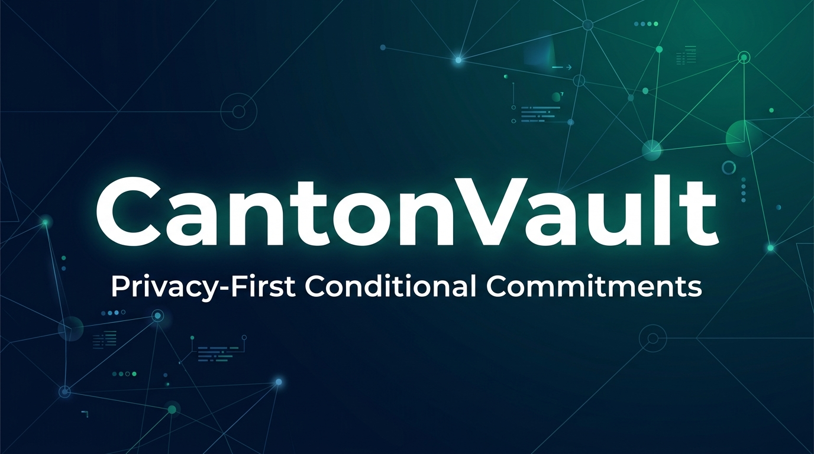
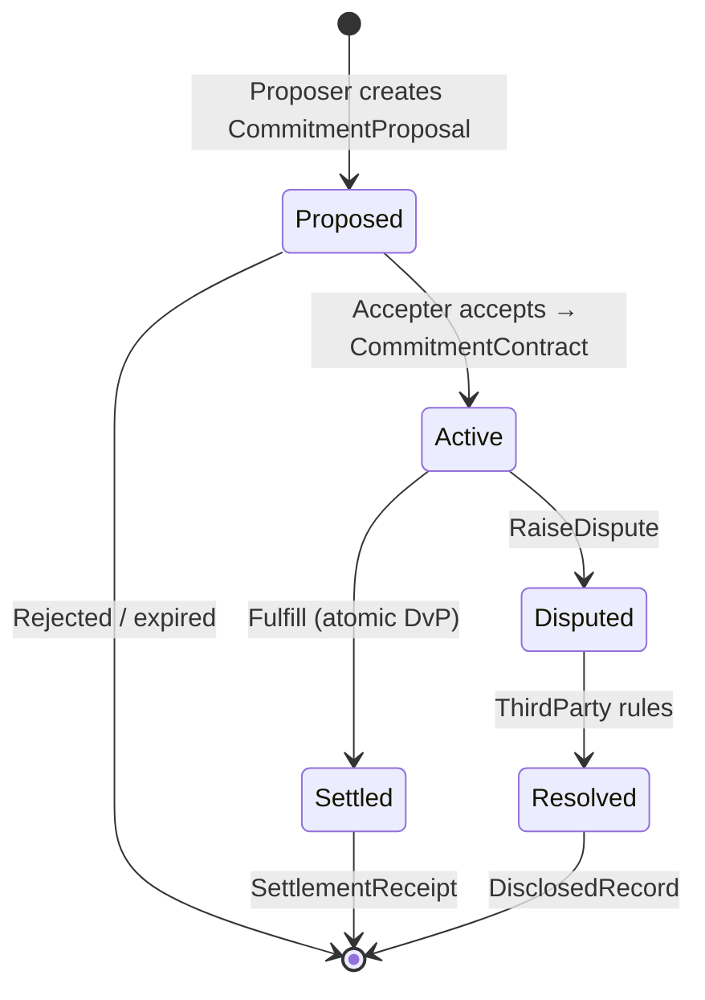
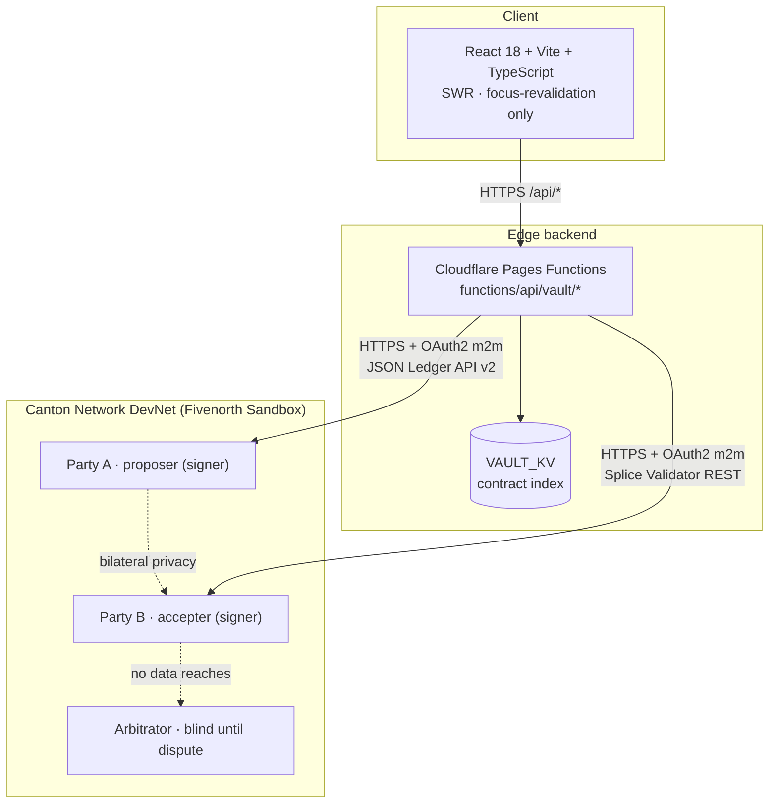

<div align="center">

# CantonVault

**Privacy-first smart-contract protocol for institutional trade finance on the Canton Network.**

[](https://www.encodeclub.com/programmes/canton-hackathon)
[]()
[](https://docs.digitalasset.com/daml)
[]()
[](./LICENSE)

[🌐 Live Demo](https://canton-vault.pages.dev) · [📺 Demo Video](https://youtu.be/VjrZj5h4ItM) · [🎤 Presentation](https://canva.link/n55x2plxh0p5fnu) · [💻 Repository](https://github.com/ruwaq/CantonVault)

</div>

<br>

> [!IMPORTANT]
> **CantonVault turns a sensitive commercial agreement into a stakeholder-scoped asset.** Two counterparties lock a deal on-ledger; the contract itself defines who is allowed to see it — and that set changes dynamically across the deal lifecycle. Privacy is not an add-on: it is an emergent property of Canton's sub-transaction privacy model combined with how the Daml templates declare signatories and observers.



---

## Overview

CantonVault is a **confidential bilateral commitment protocol** with **on-demand selective disclosure** and **atomic Delivery-vs-Payment (DvP) settlement** in Canton Coin (Amulet). It targets institutional flows — supply-chain finance, OTC block trading, regulated inter-bank settlement — where commercial confidentiality is a hard requirement, not a preference.

The protocol is deployed and verifiable on the official **Canton Network DevNet**. Every action in the live demo creates a real on-ledger transaction with a verifiable `updateId`.

| | |
|---|---|
| **What it is** | A Daml smart-contract protocol + edge-served reference UI for privacy-preserving trade finance. |
| **What problem it solves** | Lets institutions transact on a shared, atomic, trustless ledger **without leaking** positions, counterparties, or portfolio context to competitors. |
| **Why Canton** | Canton's sub-transaction privacy model guarantees a validator that does not represent a deal's stakeholders **physically never receives the transaction data**. Not encrypted-at-rest. Not access-controlled. Never transmitted. |
| **Status** | Live on DevNet · 22/22 Daml tests passing · 3 full-stack security audits completed. |
| **Submitted to** | **Build on Canton Hackathon — Track 1: Private DeFi & Capital Markets** (also fits Track 2: TradeFi, RWA & Tokenized Assets). |

---

## Table of Contents

- [Overview](#overview)
- [Key Features](#key-features)
- [How It Works](#how-it-works)
- [Use Cases](#use-cases)
- [Privacy Model](#privacy-model)
- [Architecture](#architecture)
- [Technology Stack](#technology-stack)
- [Live Deployment Proof](#live-deployment-proof)
- [Quick Start](#quick-start)
- [REST API](#rest-api)
- [Reusable DvP Pattern](#reusable-dvp-pattern)
- [Security \& Hardening](#security--hardening)
- [Repository Structure](#repository-structure)
- [Team](#team)
- [License](#license)

---

## Key Features

| Feature | Description |
|---|---|
| 🔒 **Bilateral privacy by default** | Proposals and active commitments are visible only to proposer + accepter. Competitors' validator nodes hold **no record** of the deal. |
| 👁️ **On-demand selective disclosure** | When a dispute is raised, a third party (regulator, arbitrator, clearing house) is added as observer and sees **only `amount` + `description`** — never counterparty identities, currency, or portfolio context. |
| ⚛️ **Atomic DvP settlement** | Obligation and Canton Coin payment are two legs of one transaction. Implemented via the Splice `AllocationRequest` interface; proven by `test_real_settlement_dvp`. |
| 🧾 **Immutable audit trail** | Every terminal state produces on-ledger evidence: `SettlementReceipt` for fulfillment, `DisclosedRecord` for disclosure. |
| 🔍 **On-ledger transaction verifier** | Every UI card surfaces a `🔍 Verify on-ledger` button that opens `/tx/{updateId}` and shows the real `Created`/`Archived` events from the Canton Ledger API. |
| 🌐 **Edge-served, zero-polling UI** | React 18 + SWR (focus-revalidation only) on Cloudflare Pages Functions. No Spring gateway, no Postgres, no background polling. |

---

## How It Works

A CantonVault commitment moves through four states. The privacy scope changes **dynamically** with each transition — the contract templates themselves are the disclosure policy.


```mermaid
stateDiagram-v2
    [*] --> Proposed: Proposer creates CommitmentProposal
    Proposed --> Active: Accepter accepts → CommitmentContract
    Proposed --> [*]: Rejected / expired
    Active --> Settled: Fulfill (atomic DvP)
    Active --> Disputed: RaiseDispute
    Disputed --> Resolved: ThirdParty rules
    Settled --> [*]: SettlementReceipt
    Resolved --> [*]: DisclosedRecord
```

| State | Signatories | Observers | Third-party visibility |
|---|---|---|---|
| **Proposed** | Proposer | Accepter | None — third party is referenced in payload only. |
| **Active** | Proposer + Accepter | — | None — third party still absent from the contract. |
| **Settled** | Proposer + Accepter | — | None — `SettlementReceipt` sealed as immutable proof. |
| **Disputed** | Proposer + Accepter | **ThirdParty** | Third party becomes observer via `DisputeCase`, sees only `amount` + `description`. |
| **Resolved** | Discloser + Auditor | — | `DisclosedRecord` carries only the disclosed fields. |

<details>
<summary><b>📖 Deep dive: the four templates that enforce the privacy boundary</b></summary>

The privacy guarantees flow directly from how each Daml template declares its stakeholders. There is no off-chain policy server — the contract itself is the disclosure policy.

| Template | Role in the privacy model |
|---|---|
| [`CommitmentProposal`](./cn-quickstart/quickstart/daml/licensing/daml/Vault/CommitmentProposal.daml) | Proposer is signatory, accepter is observer. Two-party scope is established at the very first action. |
| [`CommitmentContract`](./cn-quickstart/quickstart/daml/licensing/daml/Vault/CommitmentContract.daml) | Proposer + accepter are signatories. The third party is in the payload but **never** a signatory/observer. Carries `Fulfill`, `RaiseDispute`, `Refund` choices. |
| [`DisputeCase`](./cn-quickstart/quickstart/daml/licensing/daml/Vault/CommitmentContract.daml) | Created only on dispute. **This is where the third party finally becomes an observer.** Privacy scoping is dynamic by design. |
| [`DisclosedRecord`](./cn-quickstart/quickstart/daml/licensing/daml/Vault/Disclosable.daml) | A *separate* contract carrying only the disclosed fields. Counterparty identities are not in the payload. Implements the `Disclosable` interface. |
| [`SettlementReceipt`](./cn-quickstart/quickstart/daml/licensing/daml/Vault/SettlementReceipt.daml) | Immutable audit trail proving the obligation was archived after settlement. |

</details>

---

## Use Cases

### Supply-chain finance (invoice factoring)

A manufacturer needs working capital against an invoice owed by a major retailer. A financier funds it. The retailer is the natural arbitrator if delivery is disputed.

| Step | Visible to | Not visible to |
|---|---|---|
| Manufacturer & financier lock the invoice on-ledger | Manufacturer, Financier | Retailer's node is blank. Competitors see nothing. |
| Financier fulfills → Canton Coin settles atomically | Manufacturer, Financier | Same. |
| Manufacturer disputes non-delivery | Manufacturer, Financier, **+ Retailer** | Retailer sees **only the invoice amount + description**, learns nothing about the financier's portfolio. |
| Retailer rules | All three + immutable `DisclosedRecord` | Financier's other factoring deals remain invisible. |

> [!NOTE]
> SMEs typically wait **60–90 days** for invoice payment. Factoring unlocks that cash — but on a transparent chain, every factoring relationship leaks, creating reputational risk. CantonVault makes factoring invisible until a dispute demands otherwise.

### OTC block trading (dealer-to-dealer)

Dealer A wants to move a large block of bonds to Dealer B. On any transparent venue, that order is a signal — competitors front-run and the price moves against them before fill.

| Step | Market impact |
|---|---|
| Dealers lock the block on-ledger | **Zero leakage.** No competing dealer sees the order exist. |
| Atomic DvP settlement in Canton Coin | **Zero execution risk.** Bonds and payment move in one transaction. |
| Dispute escalates to clearing house | Clearing sees **amount + description only**. Dealer identities protected. |

> [!NOTE]
> The OTC bond market is **~$120 trillion** notional. It still runs on phone-brokered relationships precisely because transparent electronic venues leak inventory. CantonVault is a credible path to electronic OTC execution with privacy.

### Regulated inter-bank settlement

Two banks settle a large obligation on-ledger. The regulator — by design — cannot see live exposure. They see only what a dispute or scheduled audit reveals: the specific obligation, the amount, the timestamp. This is what post-Basel supervision asks for: **auditability without continuous surveillance**.

---

## Privacy Model

> [!IMPORTANT]
> This is the part most projects hand-wave. The privacy guarantee here is architectural, not cryptographic-on-top.

### Canton sub-transaction privacy

When a Daml contract is exercised, Canton's runtime computes the **minimal set of validators** that need to see each sub-transaction. A validator only receives data if it represents a **signatory or a declared observer** of the resulting contract.

```
A traditional blockchain:              A Canton network:
┌─────────────────────────┐           ┌──────────┐ ┌──────────┐ ┌──────────┐
│ Every node stores       │           │ Proposer │ │Accepter  │ │Competitor│
│ every transaction,      │           │  node    │ │  node    │ │   node   │
│ encrypted or not.       │           │  full    │ │  full    │ │  EMPTY   │
└─────────────────────────┘           └──────────┘ └──────────┘ └──────────┘
                                       ↑ the deal    ↑          ↑ never sent
```

In CantonVault, `CommitmentContract` has exactly two signatories: **proposer + accepter**. The third party is referenced in the contract *data* but is **never added as signatory or observer** until a dispute explicitly promotes it. So the third party's validator node physically never receives the bytes.

### Selective disclosure via Daml interfaces

The `Disclosable` Daml interface lets a contract reveal a **curated subset of its fields** to a new signatory. When a dispute is raised, CantonVault does not expose the `CommitmentContract` — it creates a fresh `DisclosedRecord` whose signatories are discloser + auditor, and whose payload contains **only** `{ amount, description, disputeReason }`. Counterparty identities, currency, and settlement state are not carried over.

This is **field-level, contract-enforced** disclosure. The Privacy Lab in the live demo visualises this across three columns: what the proposer sees, what the mediator sees (`0 agreements found` — genuinely empty), and what the mediator learns after a dispute.

---

## Architecture


```mermaid
flowchart TB
    subgraph Client["Client"]
        UI["React 18 + Vite + TypeScript<br/>SWR · focus-revalidation only"]
    end
    subgraph Edge["Edge backend"]
        Fns["Cloudflare Pages Functions<br/>functions/api/vault/*"]
        KV[("VAULT_KV<br/>contract index")]
        Fns --> KV
    end
    subgraph CantonNet["Canton Network DevNet (Fivenorth Sandbox)"]
        PA["Party A · proposer (signer)"]
        PB["Party B · accepter (signer)"]
        ARB["Arbitrator · blind until dispute"]
        PA -.bilateral privacy.-> PB
        PB -.no data reaches.-> ARB
    end
    UI -->|HTTPS /api/*| Fns
    Fns -->|HTTPS + OAuth2 m2m<br/>JSON Ledger API v2| PA
    Fns -->|HTTPS + OAuth2 m2m<br/>Splice Validator REST| PB
```

| Layer | Choice | Why |
|---|---|---|
| **Smart contracts** | Daml 3.x | Source of truth for *who can see what*. Canton's privacy guarantees flow from signatory/observer declarations. |
| **Settlement** | Splice Amulet Token Standard (`AllocationRequest`) | Same interface that powers native Canton Network Amulet transfers. Atomic DvP. |
| **Edge backend** | Cloudflare Pages Functions | Bridges the Canton JSON Ledger API v2 (commands + ACS) and Splice Validator REST (balance). No gateway, no DB. |
| **Contract index** | Cloudflare KV (`VAULT_KV`) | Append-only pointer index keyed by `contractId`. Exists because the shared sandbox validator doesn't divulge our contracts via the ACS (multi-tenant privacy). |
| **Frontend** | React 18 + Vite + TS + SWR | 3-step wizard (Create → Act → Verify) culminating in the Privacy Lab split-screen. Zero background polling — load-bearing to avoid exhausting the Cloudflare Free quota. |

---

## Technology Stack

<details>
<summary><b>🧱 Smart contracts — Daml 3.x</b></summary>

The privacy boundary lives here. Each template declares its signatories and observers; Canton's runtime enforces that no other validator receives the data. Five templates (`CommitmentProposal`, `CommitmentContract`, `DisputeCase`, `DisclosedRecord`, `SettlementReceipt`) compose into the full lifecycle. 22/22 Daml tests pass, including `test_real_settlement_dvp` which proves the DvP pattern moves real Amulet on a local Canton participant.

</details>

<details>
<summary><b>⚛️ Atomic DvP via Splice AllocationRequest</b></summary>

The `Fulfill` choice links the obligation to a Canton Coin transfer as two legs of one atomic transaction — either both settle, or neither does.

```
Fulfill
  ├─ Validates the Amulet allocation against commitment terms
  ├─ Exercises Allocation_ExecuteTransfer  ← Canton Coin moves
  ├─ Archives the CommitmentContract       ← obligation extinguished
  └─ Creates SettlementReceipt             ← immutable proof
```

The demo runs the **symbolic** settlement branch (`allocationCid = None`) because real DvP is not exercisable against the shared DevNet sandbox — the sandbox m2m operator is not the network's DSO, and Splice's `AllocationFactory_Allocate` rejects any settlement whose `instrumentAdmin != DSO`. The DvP code path itself is implemented and proven at the contract level by [`TestRealSettlement.daml`](./cn-quickstart/quickstart/daml/licensing-tests/daml/Vault/Scripts/TestRealSettlement.daml). Running it on the shared sandbox would require the operator to divulge `AmuletRules` to the m2m account — a governance step, not an engineering one.

</details>

<details>
<summary><b>🌐 Edge backend — Cloudflare Pages Functions + KV</b></summary>

The demo backend is **edge functions**, not a Spring Boot gateway or Postgres database. They bridge two Canton APIs directly:

- **Canton JSON Ledger API v2** — for commands (create/exercise) and the Active Contract Set.
- **Splice Validator REST API** — for the live Canton Coin balance.

OAuth2 m2m tokens are cached across warm invocations. The contract index lives in **Cloudflare KV** (`VAULT_KV`) — keyed by `contractId`, append-only on every create/exercise, filtered by lifecycle status on read. This exists because the shared sandbox validator doesn't divulge our contracts via the ACS (privacy of the multi-tenant environment), so we maintain our own pointer index.

</details>

<details>
<summary><b>🎨 Frontend — React 18 + Vite + TypeScript + SWR</b></summary>

SWR revalidates **on focus only** — no background polling. This is load-bearing: an earlier version that polled every 5s exhausted the Cloudflare Free 100k/day quota in hours. The UI is a 3-step wizard (**Create → Act → Verify**) culminating in the **Privacy Lab** split-screen that makes the privacy guarantee visible: three columns showing the same deal from the proposer node, the mediator node, and the post-dispute view.

</details>

---

## Live Deployment Proof

CantonVault is deployed and running on the official **Canton Network DevNet**. Every `git push` to `main` triggers an automatic build + deploy via Cloudflare Pages Git integration.

### Connection profile (verified live)

| | |
|---|---|
| **Ledger API** | `https://ledger-api.validator.devnet.sandbox.fivenorth.io/` |
| **Validator REST API** | `https://api.validator.devnet.sandbox.fivenorth.io/` |
| **Auth** | OAuth2 Client Credentials (`validator-devnet-m2m`) |
| **Canton version** | 3.5.9 |
| **Active party** | `cancore::1220a14ca128063b8dc9d1ebb0bd22633be9f2168500f4dbc1ecaeb1855b14e5acf8` |
| **Live Canton Coin balance** | **32.3M+ CC** (Splice Validator wallet; grows from Amulet holding rewards) |

### Verify it yourself (no auth required)

```bash
# Backend health — Canton version + current ledger offset
curl -s https://canton-vault.pages.dev/api/health
# → {"status":"ok","cantonVersion":"3.5.9","ledgerOffset":4564191}

# Real on-ledger Canton Coin balance (Splice Validator REST API)
curl -s https://canton-vault.pages.dev/api/vault/balance
# → {"balance":32314463.41,"locked":0,"round":54468,"party":"cancore::..."}

# Active proposals from the KV contract index
curl -s https://canton-vault.pages.dev/api/vault/proposals
```

### On-ledger transaction proofs

Every exercise lands on the Canton DevNet with a verifiable `updateId`. The UI surfaces a `🔍 Verify on-ledger` button on every toast and every card that opens `/tx/{updateId}` — fetching the real `Created`/`Archived` events from the Canton Ledger API.

| # | Scenario | Amount | `updateId` (transaction hash) | Ledger offset |
|---|---|---|---|---|
| 1 | supply-chain-finance | 5,000 CC | `1220c521048ebd4392a67d331a0cb6cebbc1beb03aed7da2b34ba1e40b4cedfec9f9` | 4297574 |
| 2 | supply-chain-finance | 7,500 CC | `12207d01a2205c3b578ff9fecf0fdefbb14cd9ba8f75f61eb6f5c652e0209e483113` | 4297626 |
| 3 | supply-chain-finance | 12,000 CC | `1220e723952221684661ac7f0a6fcf0db66e570866d062bf34ba938d23ab2090ce01` | 4297881 |
| 4 | invoice-financing | 3,000 CC | `12202b830f37bcab5a0a234565bc6acd328e8eea979d6b71967068d2430cffb89678` | 4298442 |
| 5 | otc-block-trade | 25,000 CC | `12204b7cf00a72988934e883439f48da8df2d0497435f2d9e6df87b7826aebb7d27c` | 4298435 |

> [!NOTE]
> **Settlement model.** In this demo the exercises above run on the **symbolic** settlement branch of `Fulfill` (`allocationCid = None`), so the receipts record `settlementExecuted = false`. Real Canton Coin DvP is not exercisable against the shared DevNet sandbox for the governance reason explained above. The DvP path itself is implemented and proven at the contract level.

---

## Quick Start

### Try the live demo (fastest — 90 seconds)

Open **https://canton-vault.pages.dev**. The UI is a 3-step wizard:

1. **Create** — 4-screen wizard (description → amount → parties → expiry). Send the offer → a `CommitmentProposal` lands on-ledger with a real `contractId`.
2. **Act** — Accept the proposal (it becomes a live commitment), then **Confirm delivery** to fulfill. The commitment is archived (no double-fulfill) and a `SettlementReceipt` is created on-ledger.
3. **Verify** — The **Privacy Lab** shows three columns: what you see, what the mediator sees (`0 agreements found` — the data never reached their node), and what the mediator learns after a dispute (only `amount` + `description`).
4. **Dispute flow (optional)** — On an active commitment, **Report a problem** → a `DisputeCase` makes the mediator an observer; only `amount` and `description` are revealed via a `DisclosedRecord`. **Resolve** to record the binding outcome.

### Run locally

```bash
git clone https://github.com/ruwaq/CantonVault.git
cd CantonVault/cn-quickstart/quickstart/frontend
npm install
npm run dev          # Vite dev server on :5173 (talks to the same Canton DevNet)
```

### Run the Daml tests

```bash
# 22/22 passing — privacy boundary enforcement + DvP script execution
~/.daml/bin/daml test --package-root daml/licensing-tests
```

### Interact via the DevNet CLI

```bash
cd cli && npm install && npm run build

node dist/index.js status                    # DevNet connectivity + sync offset
node dist/index.js packages                  # List vetted packages on the participant
node dist/index.js propose --amount 5000     # Create a real on-ledger proposal
```

---

## REST API

All endpoints under `https://canton-vault.pages.dev/api/vault/*`, served by Cloudflare Pages Functions talking directly to the Canton DevNet Ledger API v2. Every mutation returns the real on-ledger `updateId`.

| Method | Path | Description |
|---|---|---|
| `GET` | `/api/health` | Backend health + Canton version + ledger offset |
| `GET` | `/api/vault/balance` | Live Canton Coin balance (Splice Validator REST) |
| `GET` | `/api/vault/proposals` | List visible `CommitmentProposal`s (KV index) |
| `POST` | `/api/vault/proposals` | Create a proposal |
| `POST` | `/api/vault/proposals/{id}/accept` | Accept → creates a commitment |
| `POST` | `/api/vault/proposals/{id}/reject` | Reject a proposal |
| `GET` | `/api/vault/commitments` | List visible active commitments |
| `POST` | `/api/vault/commitments/{id}/fulfill` | Fulfill → archives + `SettlementReceipt` |
| `POST` | `/api/vault/commitments/{id}/raise-dispute` | Raise dispute → mediator becomes observer |
| `POST` | `/api/vault/commitments/{id}/refund` | Refund (after deadline) |
| `GET` | `/api/vault/receipts` | List settlement receipts |
| `GET` | `/api/vault/disclosures` | List `DisclosedRecord`s (selective disclosure evidence) |
| `GET` | `/api/vault/tx/{updateId}` | **On-ledger tx verifier** — real events from Canton Ledger API, cached 1h |

---

## Reusable DvP Pattern

CantonVault implements Delivery-vs-Payment using the Splice `AllocationRequest` interface — the same pattern that powers native Canton Network Amulet transfers.

> [!TIP]
> Developers building payment-enabled dapps on Canton can copy our script templates and contract layouts to ship instant DvP integrations. Four non-obvious lessons are encoded in [`TestRealSettlement.daml`](./cn-quickstart/quickstart/daml/licensing-tests/daml/Vault/Scripts/TestRealSettlement.daml):

1. **DSO Administration** — the Amulet allocation factory requires `instrumentAdmin = DSO`, not the contract proposer. Otherwise the validator network rejects the settlement transfer.
2. **Accepter Executor** — `Allocation_ExecuteTransfer` must be exercised by the settlement executor. We map the executor role to the accepter, since `Fulfill` is triggered by them.
3. **Timestamp Pinning** — the factory validates `requestedAt <= now`. Setting this to a future `deadline` locks settlement; always pin to contract creation time.
4. **Field-Level Assertions** — the factory adjusts internal metadata/timestamps. Validate individual fields (amount, sender, receiver) rather than strict record equality (`===`).

---

## Security & Hardening

CantonVault has been through **three independent full-stack security audits** (2026-07-03, 2026-07-18, 2026-07-25) covering all six layers: Daml contracts, Java backend, React/TypeScript frontend, serverless edge functions, and infrastructure.

<details>
<summary><b>🛡️ Critical findings remediated (selection)</b></summary>

| # | Issue | Fix |
|---|---|---|
| C1 | OAuth2 `CLIENT_SECRET` hardcoded in 5 tracked files (11 commits in history) | Fail-closed in all 5 files; reads from Cloudflare env bindings. **Action: rotate at `auth.sandbox.fivenorth.io`** — that neutralizes the leaked history. |
| C2 | The entire demo API was anonymous — `authenticated-user.js` always returned `isAdmin:true` | Bypass removed; frontend redirects to login on 401. (Demo auth later reverted by team decision: single-URL judge audience; rate-limit + symbolic settlement limit the blast radius.) |
| C3 | `seed-demo.js` fail-open — anonymous POST wiped the entire KV index | Fail-closed: returns 503 if `SEED_SECRET` is unset. |
| C4 | `Refund` with `allocationCid=Some` drained the proposer (sent CC proposer→accepter with no forward transfer to reverse). Dead code, no test coverage. | The `Some` path of `Refund` removed from Daml; now archival-only. 22/22 tests still pass. |
| C5 | DvP "real" claim was symbolic — no flow moved Canton Coin | Confirmed real DvP is not exercisable against the DevNet sandbox. `test_real_settlement_dvp` proves the contract supports real DvP on a local participant. Demo now documents symbolic settlement honestly. |
| C6 | Frontend auth bypass — any network failure logged in as admin | `DEMO_USER` fallback removed; `fetcher.ts` redirects to `/login` on 401. |

</details>

<details>
<summary><b>🔧 Hardening applied across the stack</b></summary>

- **Input validation** on every edge handler: amount (finite, >0, ≤1e12), deadline (strict ISO-8601 + future), contractId, text bounds.
- **`crypto.randomUUID()`** for all commandIds (replaced collision-prone `Date.now()+Math.random()`).
- **OAuth2 token dedup** of concurrent refreshes; guards against missing `expires_in` (NaN → IdP DoS loop).
- **`safeErrorResponse()`** — ledger upstream body never reaches the client `.message`.
- **Deadline race eliminated**: Fulfill `now < deadline`, Refund `now > deadline` (safe dead zone at `==`).
- **`allocationRequest_RejectImpl`** authorizes the accepter (sender of the leg) per Splice spec.
- **`ResolveDispute`** creates `DisclosedRecord` for **both** winner and loser.
- **Rate limit** 60/min per identity + CORS allowlist at the edge (`functions/api/_middleware.js`).
- **CI**: GitHub Actions pinned to SHA, `permissions: contents: read`, Dependabot covers `cli/`.

</details>

<details>
<summary><b>⚠️ Known limitations (by design or external block)</b></summary>

| Limitation | Status | Rationale |
|---|---|---|
| `CLIENT_SECRET` in git history (11 commits) | Pending rotation | Rotating at the IdP neutralizes it. History rewrite deferred — risky pre-finale. |
| Real DvP on DevNet | Not exercisable | Sandbox m2m is not the DSO; would require the operator to divulge `AmuletRules` to the m2m. |
| Demo is open (no auth) | Accepted for demo | Single-operator hackathon audience. Production → OAuth2 with external IdP. |

</details>

---

## Repository Structure

```text
cantonvault/
├── README.md                          # This file — the only public doc
├── LICENSE                            # MIT License
├── cantonvault_banner.jpg             # Project banner
├── cli/                               # CantonVault TypeScript CLI for DevNet
│   └── src/index.ts                   # status, propose, accept, fulfill, …
└── cn-quickstart/
    └── quickstart/                    # Main application code (cloned from upstream)
        ├── daml/licensing/            # Daml contracts (Commitment, Disclosable, Settlement)
        ├── daml/licensing-tests/      # 22/22 passing tests (privacy + DvP)
        └── frontend/                  # ← LIVE DEMO — deployed to canton-vault.pages.dev
            ├── functions/api/         # Cloudflare Pages Functions (edge backend)
            │   ├── _ledger.js         # Canton Ledger API client + KV index
            │   ├── _middleware.js     # CORS + rate limit
            │   └── vault/             # /api/vault/* endpoints + tx verifier
            ├── src/                   # React 18 / TypeScript — VaultView, Privacy Lab
            └── wrangler.jsonc         # Cloudflare config (KV binding, nodejs_compat)
```

> [!NOTE]
> The repository intentionally ships a single public `README.md`. Internal documents (jury demo guide, security audit log, session handoff, submission checklist) are kept locally only. The relevant public information they contained — settlement model, deployment proof, security hardening summary, demo walkthrough — is consolidated here.

---

## Team

| | |
|---|---|
| **Ande (andelabs)** | Solo builder. Full-stack blockchain engineer (Daml, Rust, Solidity), specializing in institutional DeFi primitives and privacy-preserving protocols. |
| **GitHub** | [@ruwaq](https://github.com/ruwaq) |

---

## License

This project is licensed under the MIT License — see the [LICENSE](./LICENSE) file for details.
