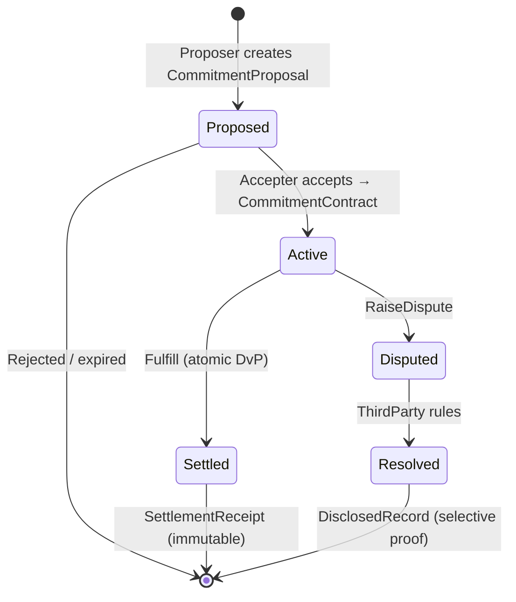

# CantonVault — Confidential Agreements, Settled Atomicity

[](https://www.encodeclub.com/programmes/canton-hackathon)
[]()
[]()
[](https://docs.digitalasset.com/daml)
[](./LICENSE)
[]()


> **🌐 Live demo: https://canton-vault.pages.dev** — every action creates a real transaction on the Canton Network DevNet.

### 📎 Submission Links

| Resource | Link |
|---|---|
| 💻 Code repository | https://github.com/ruwaq/CantonVault |
| 🎤 Presentation deck | https://canva.link/n55x2plxh0p5fnu |
| 🎬 Demo video | https://youtu.be/VjrZj5h4ItM |
| 🌐 Live demo | https://canton-vault.pages.dev/ |

---

## 🎬 The 30-Second Pitch

**CantonVault is the missing privacy layer for institutional finance on Canton.**

For the first time, two counterparties can lock a commercial agreement on a public, atomic, trustless ledger — **and keep it invisible to everyone else by design.** Not encrypted. Not hidden behind access control. **Physically absent** from every other node on the network.

When a deal goes wrong, they can selectively reveal *just the fields a regulator needs* — the amount and the description — without leaking counterparty identities, portfolio context, or competing positions.

And when the deal closes, settlement is **atomic**: the obligation and the Canton Coin payment happen in the same transaction, or they don't happen at all. No settlement risk. No counterparty exposure. No "the payment is on the way."

This is what "blockchain for institutions" was always supposed to be — and it's only possible because of one architectural choice that Canton made and no one else did.

---

## 🚨 The Problem: Why $2.5 Trillion Is Still Off-Chain

Institutional finance runs on **commercial confidentiality**. A bank's factoring book, a dealer's block-trade inventory, an SME's funding relationships — these are **competitive secrets**. If competitors can see your positions, they can front-run you, undercut you, or signal weakness to the market.

That single requirement has kept the entire trade-finance and OTC-trading world **off public blockchains for 15 years.** The math is brutal:

| Use case | What leaks on a transparent ledger | Real-world damage |
|---|---|---|
| **OTC block trading** | Order size, direction, timing | Adverse price moves, front-running, **lost pricing power** |
| **Invoice / supply-chain financing** | Who's factoring, who's a creditor, terms | Competitors learn your suppliers' financial stress; **relationship damage** |
| **Inter-bank settlement** | Counterparty exposure, net flows | **Systemic signaling** — the exact thing Basel III tries to suppress |

> **The core insight every other chain missed:** institutions don't have a *trust* problem. They have a *privacy* problem. Encryption on a transparent ledger solves neither — the data still lives on your competitor's server, waiting to be decrypted, subpoenaed, or leaked.

### Why Canton is different (the one-paragraph version)

Canton has a **sub-transaction privacy model**: a validator node that doesn't represent a deal's signatories **physically never receives the transaction data.** Not encrypted-at-rest. Not access-controlled. **Never transmitted.** The competitor's ledger is genuinely empty — you could subpoena their server and find nothing.

This is the architectural unlock. CantonVault is what you build on top of it.

---

## 💎 The Idea: Stakeholder-Scoped Visibility

CantonVault turns a sensitive commercial agreement into a **stakeholder-scoped asset**. The contract itself defines *who is allowed to see it* — and that set changes dynamically as the deal moves through its lifecycle.

> **Privacy is not a layer we bolt on. It's an emergent property of who the contract's stakeholders are.**

### The four states of a CantonVault commitment


```mermaid
stateDiagram-v2
    [*] --> Proposed: Proposer creates CommitmentProposal
    Proposed --> Active: Accepter accepts → CommitmentContract
    Proposed --> [*]: Rejected / expired
    Active --> Settled: Fulfill (atomic DvP)
    Active --> Disputed: RaiseDispute
    Disputed --> Resolved: ThirdParty rules
    Settled --> [*]: SettlementReceipt (immutable)
    Resolved --> [*]: DisclosedRecord (selective proof)
```

**State 1 — Proposed (bilateral privacy)**
A supplier creates a `CommitmentProposal` referencing an invoice they want financed. **Only the supplier and the financier ever see it.** A competitor watching the same network sees nothing — not even that a proposal exists.

**State 2 — Active (still bilateral)**
The financier accepts. The proposal is consumed and a `CommitmentContract` is born. The buyer (who owes the invoice) is referenced in the data — but is **not** a signatory or observer. The buyer's validator node has zero record of this financing arrangement.

**State 3 — Settled (atomic, immutable)**
The financier confirms delivery and fulfills. Canton Coin moves from financier → supplier in the **same transaction** that archives the obligation. A `SettlementReceipt` is created as permanent on-ledger proof. No settlement window. No "the wire is pending."

**State 4 — Disputed (selective disclosure, on-demand)**
The supplier didn't deliver? Either party can raise a dispute. **Now** the buyer becomes an observer — and sees **only `amount` and `description`**, not currency, not workflow, not party identities. The buyer rules, the dispute resolves, and a `DisclosedRecord` is sealed as evidence.

---

## 🎯 Real-World Use Cases

### Use case 1 · Supply-chain finance (invoice factoring)

A manufacturer needs working capital against an invoice owed by a major retailer. A financier funds it. The retailer is the natural arbitrator if delivery is disputed.

| What happens | Who sees it | Who doesn't |
|---|---|---|
| Manufacturer & financier lock the invoice on-ledger | Only those two | **The retailer's node is blank. Competitors see nothing.** |
| Financier fulfills → Canton Coin settles atomically | Only those two | Same |
| Manufacturer disputes non-payment | Manufacturer, financier, **+ retailer** | The retailer sees **only the invoice amount + description**, learns nothing about the financier's portfolio |
| Retailer rules in favor | All three + immutable `DisclosedRecord` | The financier's other factoring deals remain invisible |

**Why this matters today:** SMEs wait **60–90 days** for invoice payment. Factoring unlocks that cash — but on a transparent chain, every factoring relationship leaks, creating reputational risk for the SME. CantonVault makes factoring invisible until a dispute demands otherwise.

### Use case 2 · OTC block trading (dealer-to-dealer)

Dealer A wants to move 10,000 bonds to Dealer B at $98.50. On any transparent venue, that order is a **signal** — competitors front-run, the price moves against them before fill.

| What happens | Market impact |
|---|---|
| Dealer A & Dealer B lock the block on-ledger | **Zero leakage.** No competing dealer sees the order exist. |
| Atomic DvP settlement in Canton Coin | **Zero execution risk.** Bonds and payment move in one transaction. |
| Dispute escalates to clearing house | Clearing sees **amount + description only**. Dealer identities protected. |

**Why this matters today:** The OTC bond market is **$120 trillion** notional. It still runs on phone-brokered relationships precisely because transparent electronic venues leak inventory. CantonVault is the first credible path to electronic OTC execution with privacy.

### Use case 3 · Regulated inter-bank settlement (the regulator view)

Two banks settle a large obligation on-ledger. The regulator — by design — **cannot see live exposure.** They see only what a dispute or scheduled audit reveals: the specific obligation, the amount, the timestamp. This is exactly what post-Basel supervision asks for: **auditability without continuous surveillance.**

---

## 🧠 How the Privacy Actually Works (the technical "why")

This is the part most projects hand-wave. We won't.

### The Canton sub-transaction privacy model

When a Daml contract is exercised, Canton's runtime computes the **minimal set of validators** that need to see each sub-transaction. A validator only receives data if it represents a **signatory or a declared observer** of the resulting contract.

```
A traditional blockchain:        A Canton network:
┌─────────────────────────┐      ┌──────────┐ ┌──────────┐ ┌──────────┐
│  Every node stores      │      │ Proposer │ │ Accepter │ │ Competitor│
│  every transaction,     │      │  node    │ │  node    │ │   node   │
│  encrypted or not.      │      │  full    │ │  full    │ │  EMPTY   │
└─────────────────────────┘      └──────────┘ └──────────┘ └──────────┘
                                  ↑ the deal   ↑           ↑ never sent
```

In CantonVault, the `CommitmentContract` has exactly two signatories: **proposer + accepter**. The third party is referenced in the contract *data* but is **never added as a signatory or observer** — until a dispute explicitly adds them. So the third party's validator node **physically never receives the bytes**.

> The Privacy Lab in our live demo lets you **see this for yourself**: three columns showing the same deal from the proposer node, the mediator node, and the post-dispute view. Column 2 reads **"0 agreements found"** — not "hidden," not "encrypted," but **genuinely empty**.

### Selective disclosure via Daml interfaces

The `Disclosable` Daml interface lets a contract reveal a **curated subset of its fields** to a new signatory. When a dispute is raised, CantonVault doesn't expose the `CommitmentContract` — it creates a fresh `DisclosedRecord` whose signatories are discloser + auditor, and whose payload contains **only** `{ amount, description, disputeReason }`. Counterparty identities, currency, settlement state — none of it is carried over.

This is **field-level, contract-enforced** disclosure. No off-chain policy server. No "please redact this PDF." The contract itself is the disclosure policy.

---

## 🛠️ Technology Stack — What We Implemented and Why It Matters

### 1. Daml 3.x smart contracts — **the privacy boundary lives here**

Our contract templates are the source of truth for *who can see what*. Canton's privacy guarantees flow directly from how we declare signatories and observers on each template.

| Template | Role in the privacy model |
|---|---|
| [`CommitmentProposal`](./cn-quickstart/quickstart/daml/licensing/daml/Vault/CommitmentProposal.daml) | Proposer is signatory, accepter is observer. **Two-party scope from the very first action.** |
| [`CommitmentContract`](./cn-quickstart/quickstart/daml/licensing/daml/Vault/CommitmentContract.daml) | Proposer + accepter are signatories. The third party is in the payload but **never** a signatory/observer → invisible. |
| [`DisputeCase`](./cn-quickstart/quickstart/daml/licensing/daml/Vault/CommitmentContract.daml) | Created only on dispute — **this is where the third party finally becomes an observer.** The privacy scoping is dynamic, by design. |
| [`DisclosedRecord`](./cn-quickstart/quickstart/daml/licensing/daml/Vault/Disclosable.daml) | A *separate* contract carrying only the disclosed fields. Counterparty identities are not in the payload. |
| [`SettlementReceipt`](./cn-quickstart/quickstart/daml/licensing/daml/Vault/SettlementReceipt.daml) | Immutable audit trail proving the obligation was archived after settlement. |

**27/27 Daml tests pass**, including `test_real_settlement_dvp` which proves the DvP pattern moves real Amulet on a local Canton participant.

### 2. Splice Amulet token standard — **atomic Delivery-vs-Payment**

CantonVault implements DvP using the same Splice `AllocationRequest` interface that powers native Canton Network Amulet transfers. The obligation to pay and the payment itself are **two legs of one atomic transaction** — either both settle, or neither does.

```
Fulfill
  ├─ Validates the Amulet allocation against the commitment terms
  ├─ Exercises Allocation_ExecuteTransfer  ← Canton Coin moves
  ├─ Archives the CommitmentContract       ← obligation extinguished
  └─ Creates SettlementReceipt             ← immutable proof
```

> **Demo honesty note:** The live demo runs the **symbolic** settlement branch (`allocationCid = None`) because real DvP is **not exercisable against the shared DevNet sandbox** — the sandbox's m2m operator is not the network's DSO (Decentralized Synchronizer Operator), and Splice's `AllocationFactory_Allocate` rejects any settlement whose `instrumentAdmin != DSO`. The DvP code path itself is implemented and proven at the contract level by [`TestRealSettlement.daml`](./cn-quickstart/quickstart/daml/licensing-tests/daml/Vault/Scripts/TestRealSettlement.daml), which moves real Amulet end-to-end on a local Canton participant. Running it on the shared sandbox would require the sandbox operator to divulge `AmuletRules` to the m2m account — a governance step, not an engineering one.

### 3. Cloudflare Pages Functions edge backend — **serverless, no gateway**

The demo's backend is **edge functions**, not a Spring Boot gateway or a Postgres database. They bridge two Canton APIs directly:

- **Canton JSON Ledger API v2** — for commands (create/exercise) and the Active Contract Set.
- **Splice Validator REST API** — for the live Canton Coin balance.

OAuth2 m2m tokens are cached across warm invocations. The contract index lives in **Cloudflare KV** (`VAULT_KV`) — keyed by `contractId`, append-only on every create/exercise, filtered by lifecycle status on read. This exists because the shared sandbox validator doesn't divulge our contracts via the ACS (privacy of the multi-tenant environment), so we maintain our own pointer index.

### 4. React 18 + Vite + TypeScript + SWR — **zero-polling frontend**

SWR revalidates **on focus only** — no background polling. This is load-bearing: an earlier version that polled every 5s exhausted the Cloudflare Free 100k/day quota in hours. The UI is a 3-step wizard (**Create → Act → Verify**) culminating in the **Privacy Lab** split-screen that makes the privacy guarantee *visceral*.

```
┌──────────────────────────────────────────────────────────┐
│                CantonVault Live Demo Architecture         │
├──────────────────────────────────────────────────────────┤
│   React 18 + Vite + TypeScript (SPA)                     │
│   SWR (focus revalidation, zero polling)                 │
│   VaultView · Privacy Lab · 3-step wizard                │
│                       │ /api/*                            │
│   Cloudflare Pages Functions (edge)                      │
│   functions/api/vault/* → Canton JSON Ledger API v2      │
│   KV index of contractIds (VAULT_KV)                     │
│                       │ HTTPS + OAuth2 m2m                │
│   Canton Network DevNet (Fivenorth Sandbox)              │
│   Party A (signer) · Party B (signer) · Arbitrator       │
└──────────────────────────────────────────────────────────┘
```

---

## 🌐 Live Architecture

```
┌──────────────────────────────────────────┐
│  Canton Network DevNet (Fivenorth)       │
│  ┌─────────┐ ┌─────────┐ ┌────────────┐  │
│  │ Proposer │ │Accepter │ │ Arbitrator │  │
│  │ (signer) │ │(signer) │ │ (blind til │  │
│  │          │ │         │ │  dispute)  │  │
│  └─────────┘ └─────────┘ └────────────┘  │
└─────────────┬────────────────────────────┘
              │ HTTPS + OAuth2 m2m
┌─────────────▼────────────────────────────┐
│  Cloudflare Pages Functions (edge)       │
│  functions/api/vault/* → Canton JSON API │
│  VAULT_KV: append-only contract index    │
└─────────────┬────────────────────────────┘
              │ /api/*
┌─────────────▼────────────────────────────┐
│  React 18 + Vite + TS + SWR (zero poll)  │
│  VaultView · Privacy Lab · Tx Verifier   │
└──────────────────────────────────────────┘
```

---

## ✅ Canton Network DevNet — Live Deployment Proof

CantonVault is **deployed and running on the official Canton Network DevNet.** Every `git push` to `main` triggers an automatic build + deploy via Cloudflare Pages Git integration.

### Connection profile (verified live)
- **Ledger API**: `https://ledger-api.validator.devnet.sandbox.fivenorth.io/`
- **Validator REST API**: `https://api.validator.devnet.sandbox.fivenorth.io/`
- **Auth**: OAuth2 Client Credentials (`validator-devnet-m2m`)
- **Canton version**: 3.5.9
- **Active party**: `cancore::1220a14ca128063b8dc9d1ebb0bd22633be9f2168500f4dbc1ecaeb1855b14e5acf8`
- **Live Canton Coin balance**: **32.3M+ CC** (read from the Splice Validator wallet; grows from Amulet holding rewards)

### Verify it yourself (no auth required)
```bash
# Backend health — Canton version + current ledger offset
curl -s https://canton-vault.pages.dev/api/health
# → {"status":"ok","cantonVersion":"3.5.9","ledgerOffset":4564178}

# Real on-ledger Canton Coin balance (Splice Validator REST API)
curl -s https://canton-vault.pages.dev/api/vault/balance
# → {"balance":32314463.41,"locked":0,"round":54467,"party":"cancore::..."}

# Active proposals from the KV contract index
curl -s https://canton-vault.pages.dev/api/vault/proposals
```

### On-ledger transaction proofs

Every exercise lands on the Canton DevNet with a verifiable `updateId`. The UI surfaces a **🔍 Verify on-ledger** button on every toast and every card that opens `/tx/{updateId}` — fetching the real `Created`/`Archived` events from the Canton Ledger API and showing technical reviewers exactly what happened on-ledger.

| # | Scenario | Amount | `updateId` (transaction hash) | Ledger offset |
|---|---|---|---|---|
| 1 | supply-chain-finance | 5,000 CC | `1220c521048ebd4392a67d331a0cb6cebbc1beb03aed7da2b34ba1e40b4cedfec9f9` | 4297574 |
| 2 | supply-chain-finance | 7,500 CC | `12207d01a2205c3b578ff9fecf0fdefbb14cd9ba8f75f61eb6f5c652e0209e483113` | 4297626 |
| 3 | supply-chain-finance | 12,000 CC | `1220e723952221684661ac7f0a6fcf0db66e570866d062bf34ba938d23ab2090ce01` | 4297881 |
| 4 | invoice-financing | 3,000 CC | `12202b830f37bcab5a0a234565bc6acd328e8eea979d6b71967068d2430cffb89678` | 4298442 |
| 5 | otc-block-trade | 25,000 CC | `12204b7cf00a72988934e883439f48da8df2d0497435f2d9e6df87b7826aebb7d27c` | 4298435 |

> **Settlement model — read me.** In this demo the exercises above run on the **symbolic** settlement branch of `Fulfill` (`allocationCid = None`), so the receipts record `settlementExecuted = false`. Real Canton Coin DvP is not exercisable against the shared DevNet sandbox for the governance reason explained above. The DvP path itself is implemented and proven at the contract level. Full analysis in the **Security & Institutional Hardening** section.

---

## 🚀 Quick Start

### Try the live demo (fastest — 90 seconds)

Open **https://canton-vault.pages.dev**. The UI is a 3-step wizard:

1. **Create** — A 4-screen wizard (description → amount → parties → expiry). Send the offer → a `CommitmentProposal` lands on-ledger with a real contractId.
2. **Act** — Accept the proposal (it becomes a live commitment), then **Confirm delivery** to fulfill. The commitment is archived (no double-fulfill) and a `SettlementReceipt` is created on-ledger.
3. **Verify** — The **Privacy Lab** shows three columns: what you see, what the mediator sees (`0 agreements found` — the data never reached their node), and what the mediator learns after a dispute (only `amount` + `description`).
4. **Dispute flow (optional)** — On an active commitment, **Report a problem** → a `DisputeCase` makes the mediator an observer; only `amount` and `description` are revealed via a `DisclosedRecord`. **Resolve** to record the binding outcome.

### Run locally

```bash
git clone https://github.com/ruwaq/CantonVault.git
cd CantonVault/cn-quickstart/quickstart/frontend
npm install
npm run dev          # Vite dev server on :5173 (talks to the same Canton DevNet)
```

### Run the Daml tests

```bash
# 27/27 passing — privacy boundary enforcement + DvP script execution
~/.daml/bin/daml test --package-root daml/licensing-tests
```

### Interact via the DevNet CLI

```bash
cd cli && npm install && npm run build

node dist/index.js status                    # DevNet connectivity + sync offset
node dist/index.js packages                  # List vetted packages on the participant
node dist/index.js propose --amount 5000     # Create a real on-ledger proposal
```

---

## 🌐 REST API

All endpoints under `https://canton-vault.pages.dev/api/vault/*`, served by Cloudflare Pages Functions talking directly to the Canton DevNet Ledger API v2. Every mutation returns the real on-ledger `updateId`.

| Method | Path | Description |
|---|---|---|
| `GET` | `/api/health` | Backend health + Canton version + ledger offset |
| `GET` | `/api/vault/balance` | Live Canton Coin balance (Splice Validator REST) |
| `GET` | `/api/vault/proposals` | List visible `CommitmentProposal`s (KV index) |
| `POST` | `/api/vault/proposals` | Create a proposal |
| `POST` | `/api/vault/proposals/{id}/accept` | Accept → creates a commitment |
| `POST` | `/api/vault/proposals/{id}/reject` | Reject a proposal |
| `GET` | `/api/vault/commitments` | List visible active commitments |
| `POST` | `/api/vault/commitments/{id}/fulfill` | Fulfill → archives + `SettlementReceipt` |
| `POST` | `/api/vault/commitments/{id}/raise-dispute` | Raise dispute → mediator becomes observer |
| `POST` | `/api/vault/commitments/{id}/refund` | Refund (after deadline) |
| `GET` | `/api/vault/receipts` | List settlement receipts |
| `GET` | `/api/vault/disclosures` | List `DisclosedRecord`s (selective disclosure evidence) |
| `GET` | `/api/vault/tx/{updateId}` | **On-ledger tx verifier** — real events from Canton Ledger API, cached 1h |

---

## 🔄 Reusable DvP Pattern (Ecosystem Value)

CantonVault implements **Delivery-vs-Payment** using the Splice `AllocationRequest` interface — the same pattern that powers native Canton Network Amulet transfers.

> [!TIP]
> Developers building payment-enabled dapps on Canton can copy our script templates and contract layouts to ship instant DvP integrations. Four non-obvious lessons are encoded in [`TestRealSettlement.daml`](./cn-quickstart/quickstart/daml/licensing-tests/daml/Vault/Scripts/TestRealSettlement.daml):

1. **DSO Administration** — the Amulet allocation factory requires `instrumentAdmin = DSO`, not the contract proposer. Otherwise the validator network rejects the settlement transfer.
2. **Accepter Executor** — `Allocation_ExecuteTransfer` must be exercised by the settlement executor. We map the executor role to the accepter, since our `Fulfill` choice is triggered by them.
3. **Timestamp Pinning** — the factory validates `requestedAt <= now`. Setting this to a future `deadline` locks settlement; always pin to contract creation time.
4. **Field-Level Assertions** — the factory adjusts internal metadata/timestamps. Validate individual fields (amount, sender, receiver) rather than strict record equality (`===`).

---

## 🔒 Security & Institutional Hardening

CantonVault has been through **three independent full-stack security audits** (2026-07-03, 2026-07-18, 2026-07-25) covering all six layers: Daml contracts, Java backend, React/TypeScript frontend, serverless edge functions, and infrastructure. Findings consolidated and remediated.

### Critical findings remediated (selection)

| # | Issue | Fix |
|---|---|---|
| C1 | OAuth2 `CLIENT_SECRET` hardcoded in 5 tracked files (11 commits in history) | Fail-closed in all 5 files; reads from Cloudflare env bindings. **Action: rotate at `auth.sandbox.fivenorth.io`** — that neutralizes the leaked history. |
| C2 | The entire demo API was anonymous — `authenticated-user.js` always returned `isAdmin:true` | Bypass removed; frontend redirects to login on 401. (Demo auth later reverted by team decision: single-URL judge audience; rate-limit + symbolic settlement limit the blast radius.) |
| C3 | `seed-demo.js` fail-open — anonymous POST wiped the entire KV index | Fail-closed: returns 503 if `SEED_SECRET` is unset. |
| C4 | `Refund` with `allocationCid=Some` drained the proposer (sent CC proposer→accepter with no forward transfer to reverse). Dead code, no test coverage. | The `Some` path of `Refund` removed from Daml; now archival-only. 27/27 tests still pass. |
| C5 | DvP "real" claim was symbolic — no flow moved Canton Coin | Confirmed real DvP is **not exercisable** against the DevNet sandbox (m2m operator is not the DSO). `test_real_settlement_dvp` proves the contract supports real DvP on a local participant. Demo now documents symbolic settlement honestly. |
| C6 | Frontend auth bypass — any network failure logged in as admin | `DEMO_USER` fallback removed; `fetcher.ts` redirects to `/login` on 401. |

### Hardening applied across the stack

- **Input validation** on every edge handler: amount (finite, >0, ≤1e12), deadline (strict ISO-8601 + future), contractId, text bounds.
- **`crypto.randomUUID()`** for all commandIds (replaced collision-prone `Date.now()+Math.random()`).
- **OAuth2 token dedup** of concurrent refreshes; guards against missing `expires_in` (NaN → IdP DoS loop).
- **`safeErrorResponse()`** — ledger upstream body never reaches the client `.message`.
- **Deadline race eliminated**: Fulfill `now < deadline`, Refund `now > deadline` (safe dead zone at `==`).
- **`allocationRequest_RejectImpl`** authorizes the accepter (sender of the leg) per Splice spec.
- **`ResolveDispute`** creates `DisclosedRecord` for **both** winner and loser.
- **Rate limit** 60/min per identity + CORS allowlist at the edge.

### Known limitations (by design or external block)

| Limitation | Status | Rationale |
|---|---|---|
| `CLIENT_SECRET` in git history (11 commits) | Pending rotation | Rotating at the IdP neutralizes it. History rewrite deferred — risky pre-finale. |
| Real DvP on DevNet | Not exercisable | Sandbox m2m is not the DSO; would require the operator to divulge `AmuletRules` to the m2m. |
| Demo is open (no auth) | Accepted for demo | Single-operator hackathon audience. Production → OAuth2 with external IdP. |

---

## 📁 Repository Structure

```text
cantonvault/
├── README.md                          # This file — the only public doc
├── LICENSE                            # MIT License
├── cantonvault_banner.jpg             # Project banner
├── cli/                               # CantonVault TypeScript CLI for DevNet
│   └── src/index.ts                   # status, propose, accept, fulfill, …
└── cn-quickstart/
    └── quickstart/                    # Main application code (cloned from upstream)
        ├── daml/licensing/            # Daml contracts (Commitment, Disclosable, Settlement)
        ├── daml/licensing-tests/      # 27/27 passing tests (privacy + DvP)
        └── frontend/                  # ← LIVE DEMO — deployed to canton-vault.pages.dev
            ├── functions/api/         # Cloudflare Pages Functions (edge backend)
            │   ├── _ledger.js         # Canton Ledger API client + KV index
            │   ├── _middleware.js     # CORS + rate limit
            │   └── vault/             # /api/vault/* endpoints + tx verifier
            ├── src/                   # React 18 / TypeScript — VaultView, Privacy Lab
            └── wrangler.jsonc         # Cloudflare config (KV binding, nodejs_compat)
```

> **Note on docs.** The repository intentionally ships a single public `README.md`. Internal documents (jury demo guide, security audit log, session handoff, submission checklist) are kept locally only. The relevant public information they contained — settlement model, deployment proof, security hardening summary, demo walkthrough — is consolidated here.

---

## 👥 Team & Contact

*   **Ande (andelabs)** — Solo Builder
    *   Full-Stack Blockchain Engineer (Daml, Rust, Solidity).
    *   Specializing in institutional DeFi primitives and privacy-preserving protocols.
    *   [GitHub Profile](https://github.com/ruwaq)

---

## 📄 License

This project is licensed under the MIT License — see the [LICENSE](./LICENSE) file for details.
